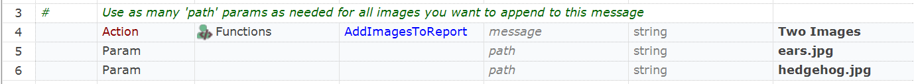

 [Download Now](https://inflectra.github.io/DownGit/#/home?url=https://github.com/Inflectra/rapise-powerpack/tree/master/AddImagesToReport)


# AddImagesToReport

Easy way to add an array of images into Rapise report:
```javascript
function AddImagesToReport(/**string*/message, /**string|array*/path)
```

## Using

Add contents of [User.js](User.js) into your test's `User.js`.

## Calling form JavaScript

```javascript

```

## Calling form RVL

