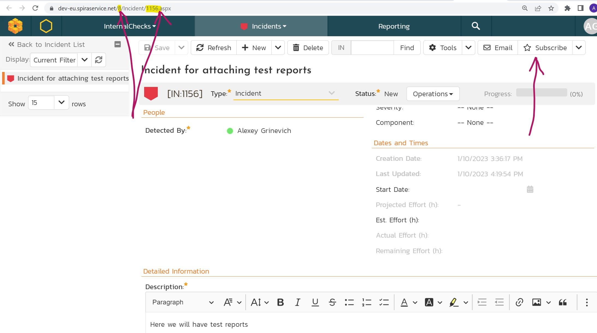

 [Download Now](https://inflectra.github.io/DownGit/#/home?url=https://github.com/Inflectra/rapise-powerpack/tree/master/AttachSummaryReportToSpiraAndSendEmails)


# Summary

You may want specific tests to send summary report with test execution status by email.

This is an example that is uploading a report to the Spira incident and Spira sends a notifications emails.

## Using

1. Create an incident in Spira. 

2. Note `Project ID` and `Incident ID` (from the incident URL)

3. Note the `Subscribe` button - any Spira user may subscribe and receive notifications on this incident.

4. Copy contents of [Lib](Lib) folder into your testing framework.

5. Put this snippet into `User.js` of your test project (replace `Project ID` and `Incident ID` with your values):

```javascript
SeSOnTestReportReady(function(){
	Log("Test done with status: "+g_testPassed);
	Log("Report file: "+g_reportFileName);
	
	var htmlName = "Report.html";
	var ldr = new ActiveXObject("Rapise.LogLoader");
	ldr.LoadTrp(g_reportFileName);
	ldr.ExportAsHtml("Lib\\LibSendSummaryReport\\Templates\\TestOnlyTpl.tt", htmlName);
	var text = File.Read(htmlName);
	
	Spira_GenerateTestSummaryReport(htmlName, /** spira project id */8, /** incident id */ 1156);
});
```

Now every time you run the test each subscribed user will get a notification email. 

If you are not getting an email, first check that incident comments get updated after you run a test case. If so, you may need to update [notification settings](https://spiradoc.inflectra.com/Spira-Administration-Guide/Template-Notifications/) in Spira.
