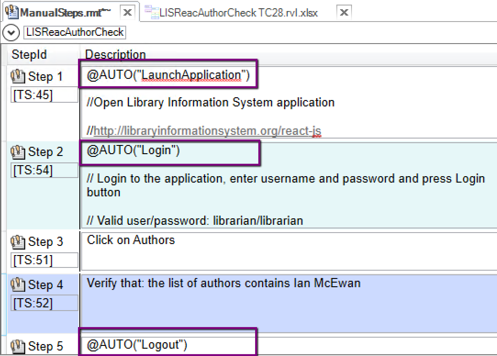
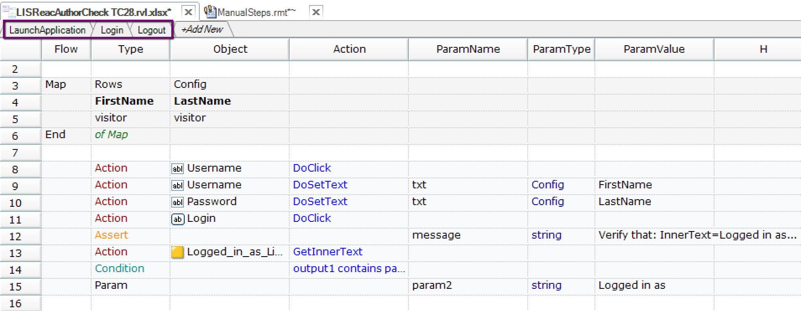

# AutoStepForManual

This `AUTO` function wraps the RVL sheet call to return pass/fail status to the manual test player.

## Usage

Copy the function to `*.user.js` file or any other common file you include in every test.

## Demo

Here is an example of a manual test with a few automated steps. Notice calls to `AUTO` function.

And this is the RVL implementation.

