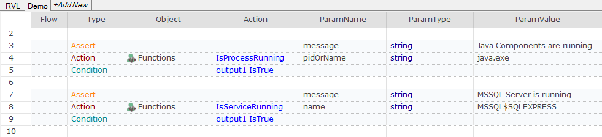

# CheckServiceOrProcessRunning

Contains `IsProcessRunning` and `IsServiceRunning` functions.

## Usage

Copy the function to `User.js` file or any other common file you include in every test.

## Demo

Here is an example of using the functions from JavaScript mode: 

```javascript
// Print names and ids of all processes to the log
IsProcessRunning();

// Check process with id 6628
var res = IsProcessRunning(6628);
Tester.Message(res);

// Check process with name java.exe
var res = IsProcessRunning("java.exe");
Tester.Message(res);

// Print state of all services to the log
IsServiceRunning();

// Check if MSSQL service is running
var res = IsServiceRunning("MSSQL$SQLEXPRESS");
Tester.Message(res);
```

And this is the RVL implementation.




