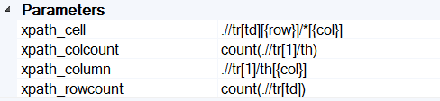
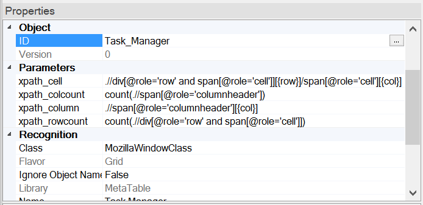

 [Download Now](https://inflectra.github.io/DownGit/#/home?url=https://github.com/Inflectra/rapise-powerpack/tree/master/DOMMetaTable)

# MetaTable user Library

MetaTable is a way to work with custom web tables in Rapise.

This package contains a library LibMetaTable with single object: *HTMLMetaTable*

## Video Tutorial

You may find live example demonstrated in this webinar recording:

## API

### Actions

`DoClickCell(/**string|number*/ row, /**string|number*/ col, /**string*/ clickType, /**number*/ xOffset, /**number*/ yOffset)`

Click at the cell specified by row and col.

* row - [required, string or number] row index (number) or cell text (string) to click.
* col - [required, string or number] column index (number) or column header text to click.
* clickType - [optional, default - L] one of L, LD, R, RD, M, MD
* xOffset, yOffset - [optional, number] pixel offset within a cell to click. Default is middle of the cell.

`DoClickText(/**string*/textOrRegexp, /**string*/clickType)`

Click at the cell specified by its text.
* textOrRegexp - cell text to click at.
* clickType - [optional, default - L] one of L, LD, R, RD, M, MD

### Properties

`GetColumnCount()`

Get number of columns in the table.

`GetColumnName(/**number*/index)`

Get column caption by index.
* index - [required, number] column name to find.

`GetColumnIndex(/**string*/columnName)`

Get column index by caption.
* columnName - [required, string] get index of the column by caption.

`GetRowCount()`

Get number of rows in the table.

`GetCell(/**number*/row, /**string|number*/col)`

Get cell text.
* row - [required, string or number] row index (number) or cell text (string) to find.
* col - [required, string or number] column index (number) or column header text to find.

## Using HTMLMetaTable

You need to do the following steps to use this library in your test:

1. Add LibMetaTable to your test framework (or to your test).
2. Learn table's root.
3. If needed, modify XPath properties.

### Adding Library To Your Test

Download this package. Copy `Lib` folder into your test folder (see https://github.com/Inflectra/rapise-samples/tree/master/DynamicWebTable as example).

### Learning

Use simulated learn and spy to learn the root of the meta table.

### Customizing XPath Properties

Meta table has customizable properties. Default values define XPath statements to gather required table parameters, i.e.:

The these properties use 2 input parameters {col} and {row} replaced with 1-based column and row indices correspondingly.

Good example of modifying these properties to fit a custom table is available here https://github.com/Inflectra/rapise-samples/tree/master/DynamicWebTable :

