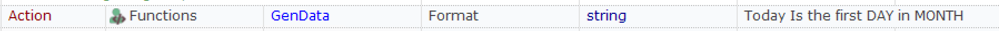

# Rapise Data Generator

Sometimes you need to feed you application with demo data that is human-readable but still random.

This test project may be used for the following tasks:

1. Generate Value by template on demand when executing a test, i.e.:
    * Single value, i.e.
`###-##-####` => `327-04-2730`

    * Date in specified format, i.e.: `dd/mm/yyyy` => `12/10/1995`
'

    * Arbitrary string by formatted template, i.e.:
`Today Is the first DAY in MONTH`
=>
`Today Is the first Tue in Sep`

2. Generate personal contact information, i.e.: 
    ```
    IND:1 
    GUID:9a035586-0adf-c549-55cc-b508ecd7ace0
    PHONEMOBILE:(958) 102-8877
    PHONEHOME:(486) 886-4047
    PHONEWORK:(078) 147-9626 ext 448 
    SSN:771-73-3809
    BIRTHDAY:11/12/1958
    GENDER:F
    GENDERFULL:Female 
    FIRST:Cora 
    LAST:Hurley 
    STATECODE:RI 
    STREET:Locust Street 
    CITY:Sparkill 
    APPARTMENT:1253 
    ZIP:93442 
    ADDRESS:1253 Locust Street, Sparkill, RI, 93442 COMPANY:Qualitern
    EMAIL:cora.hurley@qualitern.com`
    ```
3. Generate Spreadsheet with needed number of contacts by template, i.e. 
    
    to
    

All generator logic and arrays of sample values are defined here in the `User.js` file and may be modified to fit your needs.

This test project has 3 **RVL** sheets, demonstrating each capability separately:


## Generate Value By Template

If you want to use it in your project, you just need Copy & Paste contents of this `User.js` into `User.js` of your test. Then you have the `GenData` function available:



Or, from **JavaScript**:

```javascript
var str = GenData('Today Is the first DAY in MONTH');
```

By default it recognizes the following template variables:

|	Pattern	|	Description	|	Example
|--		|--		|--	
|	#	|	Digit 0-9	|	3
|	dd	|	Day of month (1-28)	|	21
|	mm	|	Month number	|	10
|	yy	|	00-99	|	75
|	yyyy	|	Year (1950-2000)	|	1993
|	GUID	|	GUID	|	00eccc37-6802-9adf-22f6-b376826d73c7
|	DAY	|	Mon-Sat	|	Fri
|	NAME	|	Random name	|	Belinda
|	BOYNAMES	|	Random male name	|	William
|	GIRLNAMES	|	Random female name	|	Olivia
|	SURNAME	|	Random last name	|	Keller
|	MONTH	|	Jan-Dec	|	Apr
|	COLOR	|	Color	|	Green
|	CAR	|	Car vendor	|	Mazda
|	STREET	|	Random street name	|	Main Street
|	STATE	|	State name	|	Arkansas
|	STATECODE	|	State code	|	AR
|	CITY	|	Randome city name	|	Esmont
|	COMPANY	|	Random company name	|	Earthmark


## Generate Random Person's Data

If you want to use it in your project, you just need Copy & Paste contents of this `User.js` into `User.js` of your test. 

Then you have `GenNextContact` function available:


Or, in **JavaScript**:

```javascript
// By default GenNextContact saves contact data into global variable 'LastPerson'.
GenNextContact();
Tester.Message("Contact data: "+LastPerson.toString());
```

Default person has the following fields (defined in `PersonTemplate` variable):

|	Template Field	|	Description	|	Example
|--		|--		|--	
|	IND	|	Sequential number, starting from 0	|	15
|	GUID	|	GUID	|	bdd5db0e-4dbc-5d46-a2a2-25a48d6a80ea
|	PHONEMOBILE	|	Mobile	|	(479) 1910-2473
|	PHONEHOME	|	Home phone	|	(834) 808-8941
|	PHONEWORK	|	Work phone	|	(836) 579-9406
|	SSN	|	Social Secutiry Number	|	957-35-9782
|	BIRTHDAY	|	Date of Birth	|	1991
|	GENDER	|	M/F	|	M
|	GENDERFULL	|	Male	|	Male
|	FIRST	|	First Name	|	John
|	LAST	|	Last Name	|	Smith
|	STATECODE	|	State code	|	AL
|	STATE	|	State name	|	Alaska
|	STREET	|	Street name	|	Main Street
|	CITY	|	City name	|	Esmont
|	APPARTMENT	|	Appartment number	|	317
|	ZIP	|	Zip code	|	12345
|	ADDRESS	|	Full address	|	9453 Oak Street, Chical, FL, 20571
|	COMPANY	|	Random company name	|	Insurety
|	EMAIL	|	email address	|	john.smith@insurety.com

## Generate Spreadsheet with Contact Data

You may get any number of contacts in the spreadsheet by downloading and running this test project.

It produces 50 contacts and saves into `Data.xlsx`. You may take it and use as data source for your test.

The spreadsheet is produced by the call to `GenDataSpreadsheet`:


Or, in **JavaScript**:

```javascript
GenDataSpreadsheet("TemplateData.xlsx", "Data.xlsx", 50);
```

You may modify the call to change the number of rows to produce. You may also modify `TemplateData.xlsx` to adjust generated contact information or column names.

