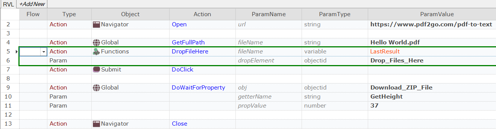

 [Download Now](https://inflectra.github.io/DownGit/#/home?url=https://github.com/Inflectra/rapise-powerpack/tree/master/DropFileHere)


# DropFileHere

This sample contains a DropFileHere function to drop file path to a drop area on a page.

```javascript
/**
 * Drops file from file system to a drop area on a page.
 * @param fileName Full path to the file.
 * @param dropElement Object Id of a drop element.
 */
function DropFileHere(/**string*/ fileName, /**objectId*/ dropElement)
```

## Using

Add contents of [User.js](User.js) into your test's `User.js`.

## Example: Calling from RVL




