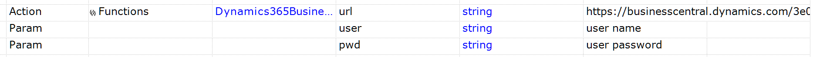

# Dynamics365BusinessCentralLaunch

Use this test to ensure that Dynamics 365 Business Central home page is opened in a browser. The test performs login if necessary.

## Usage

1. Put this function into `*.user.js` file of your test. Update relative path to this test if necessary.

```javascript
function Dynamics365BusinessCentralLogin(/**string*/ url, /**string*/ user, /**string*/ pwd)
{
	var login_params = { url: url, user: user, pwd: pwd	};
	Global.DoInvokeTest('%WORKDIR%/../Dynamics365BusinessCentralLaunch/Dynamics365BusinessCentralLaunch.sstest', login_params);
}
```

2. In your test put this at the beginning of the `Test` function.

```javascript
Dynamics365BusinessCentralLogin("https://businesscentral.dynamics.com/<id of your instance>/", "<user name>", "<user password>");
```

Or call login in RVL:



