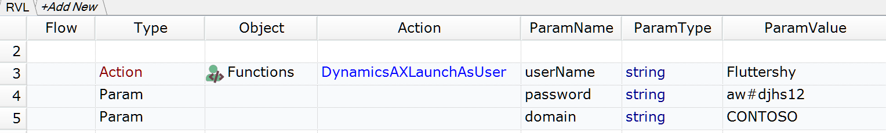

# DynamicsAXLaunchAsUser

This `DynamicsAXLaunchAsUser` function helps to execute Dynamics AX 2012 client under different user accounts.

## Prerequisites

Install `PsTools` as described in this [KB article](https://www.inflectra.com/Support/KnowledgeBase/KB305.aspx).

## Usage

Copy the function to `*.user.js` file or any other common file you include in every test.

## Demo

Here is an example of calling the function from JavaScript.

```javascript
DynamicsAXLaunchAsUser("Fluttershy", "aw#djhs12", "CONTOSO");
```

And this is the RVL usage example.




