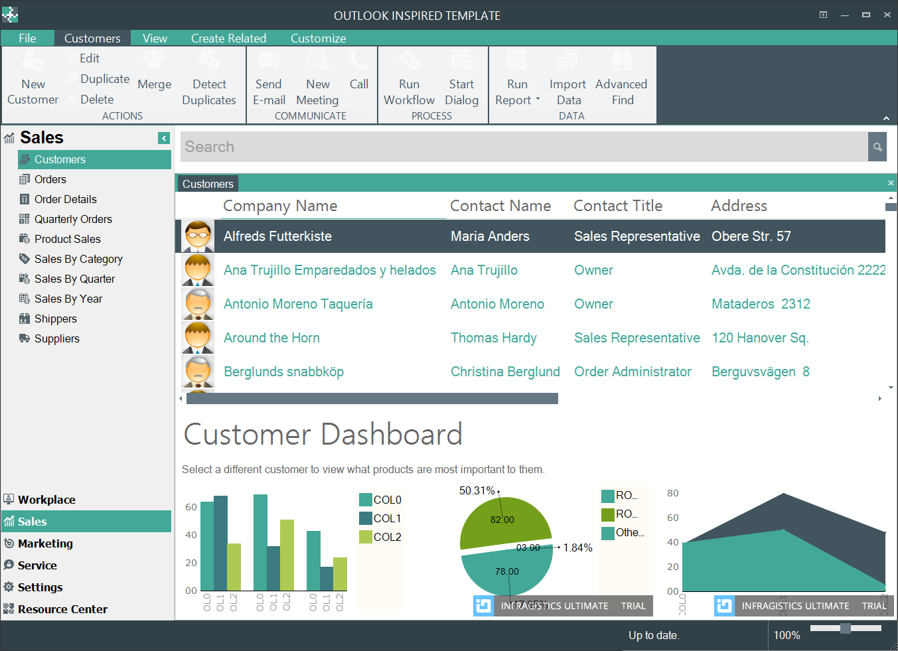
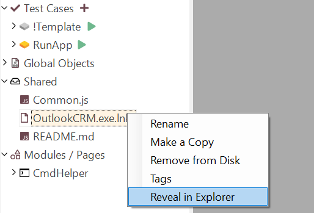
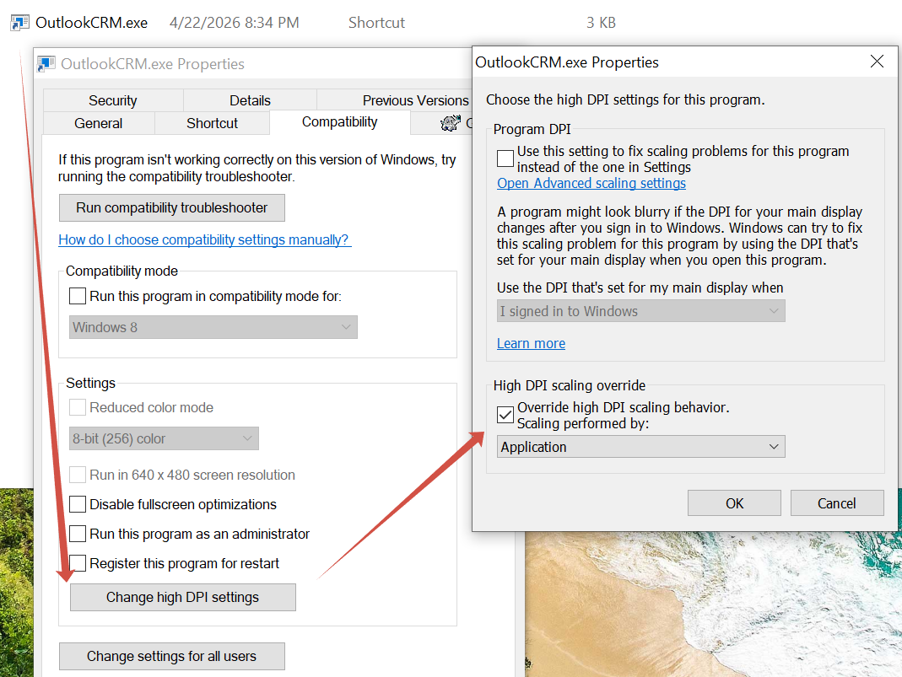
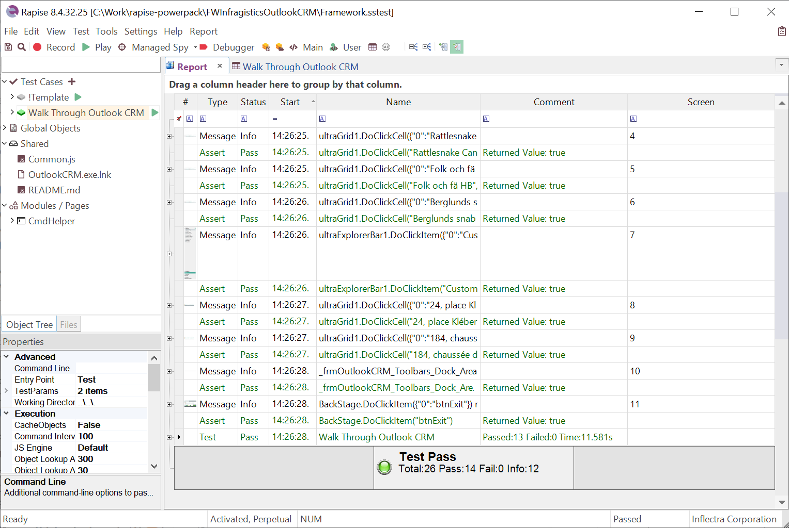
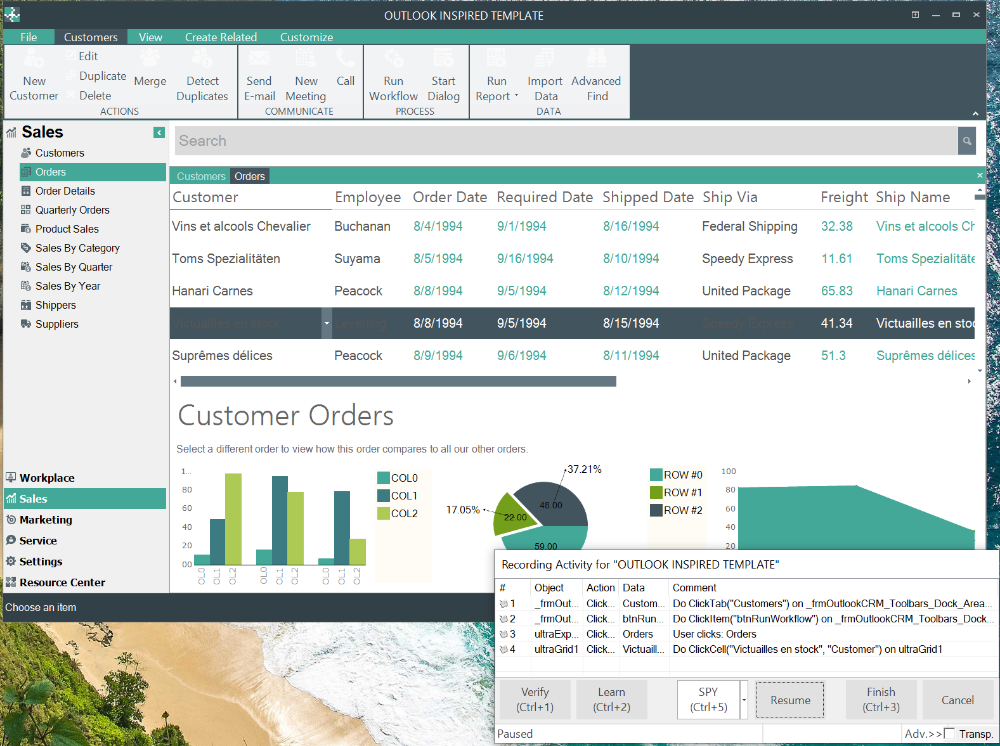
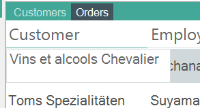
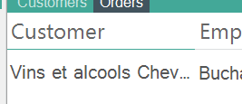

 [Download Now](https://inflectra.github.io/DownGit/#/home?url=https://github.com/Inflectra/rapise-powerpack/tree/master/FWInfragisticsOutlookCRM)

# Automating Infragistics OutlookCRM Sample with Rapise

`OutlookCRM.exe` is an Infragistics Windows Forms sample application:

## Preparing

You need to have Infragistics Windows Forms samples installed in order to run this test.

This framework contains a shortcut configured to run the executable properly (`OutlookCRM.exe.lnk`). This is important to have DPI scaling set correctly so that recording and playback work smoothly.

However, the included `.lnk` file may point to a different location of the `.exe`, so you may need to tweak it:

1. Right-click `Shared/OutlookCRM.exe.lnk` (visible on the left in the Object Tree panel) and choose "Reveal in Explorer".

   

2. Make sure it points to the `OutlookCRM.exe` that you have installed (double-clicking the link should launch the app).

The purpose of this shortcut is to configure DPI scaling settings for an application without its own embedded manifest. The configuration should look like this:

## Executing

Play the test **Walk Through Outlook CRM**. It should complete without failures and close the application automatically.

## Recording

You may also record your own test, but make sure the app is launched via the shortcut.

> **Note:** If you have multiple monitors and experience troubles with recording or playback, try doing everything on the primary monitor first.

Also note that a tooltip may appear over an element while recording:

In such cases, make sure to click before the tooltip appears, or your action may be captured incorrectly.

Another option is to resize the column so that it is fully visible without tooltips.

## Application Start/Stop

The application lifecycle is managed automatically in `Common.js` via shared hooks that run before and after each test case.

- **Start:** Before each test, the application is launched using the `CmdHelper.DoRunShortcut` Page Object action, which executes the shortcut at `Shared/OutlookCRM.exe.lnk`. This ensures the correct DPI scaling settings are applied.
- **Stop:** After each test, `Global.DoKillByName("OutlookCRM.exe")` is called. In practice, the sample test already closes the application gracefully via **File > Exit** clicks, so this call normally does nothing. It serves as a safeguard to ensure the process is terminated if the test fails before reaching that point.

Both hooks are guarded by a `g_entryPointName == "Test"` check, so they only run during a full test case execution. When you use "Play Selection" to run a subset of steps, these hooks are skipped — meaning the application may remain running while you are debugging or improving a test.

If you need to customize startup or teardown behavior, edit `Common.js` at the framework shared folder.

## Creating Your Test Case

You may either clone the **!Template** test case (it has the Rapise library for Infragistics already configured) or create a new desktop Test Case and then use **Tools > Libraries** to choose **Infragistics**.

## Notes

1. This sample uses the [CmdHelper](https://github.com/Inflectra/rapise-powerpack/tree/master/FWUsefulPageObjects/PageObjects/CmdHelper/README.md) public Page Object to run a shortcut.
