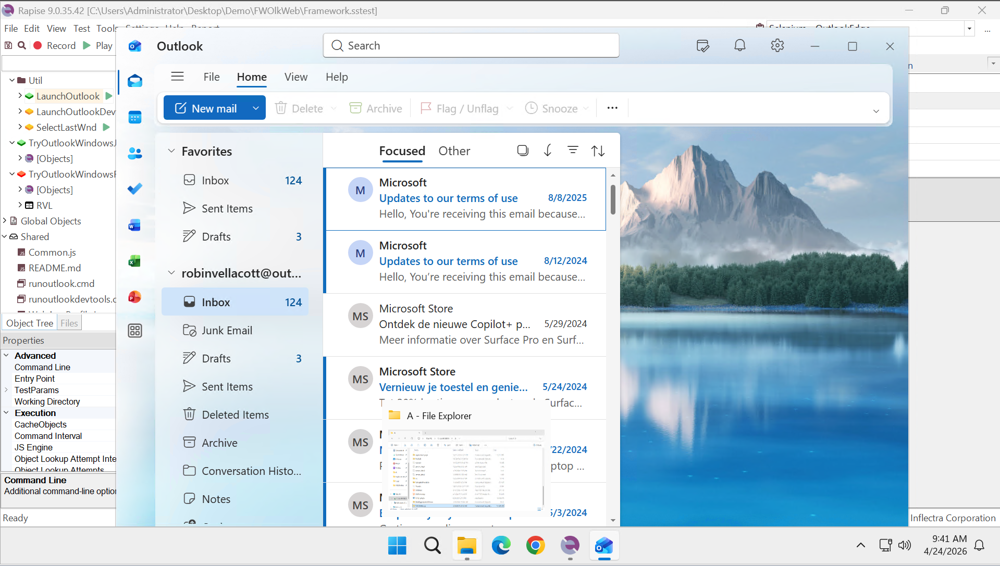

 [Download Now](https://inflectra.github.io/DownGit/#/home?url=https://github.com/Inflectra/rapise-powerpack/tree/master/FWOlkWeb)

# Automating Desktop Outlook olk.exe as a Web App using Rapise

This is a working sample project. The goal is to demonstrate working with Outlook (olk.exe) as a web application.

    Note: The same approach may be used for automating Electron-based application. I.e. those that use chrome/edge under the hood.

## Using

Download this sample test framework and open it with Rapise. Now you may launch Outlook using **LaunchOutlook** test case, create and record new test cases.

## Framework Configuration

We did the following tweaks to enable recording and playback:

1. `runoutlook.cmd` is executing olk.exe with debug port 9222 enabled.
2. `runoutlookdevtools.cmd` is the same, but it also shows DevTools for this instance.
3. `Selenium - OutlookEdge` profile is configured to connect a web application at port 9222
    
4. WebAppProfile.json - contains some tweaks to better handle object names and attributes in Outlook while recording. It has modified elementName handler to capture toolbar button names properly.

## Test Cases

There are 3 utility test cases (in the Util folder):

1. **LaunchOutlook** - run outlook using `runoutlook.cmd` (so it is ready for recording)
2. **LaunchOutlookDevtools** - the same, but with DevTools
3. **SelectLastWnd** - if you open a popup window in outlook and want to start recording from it, run this test first.

There are also 2 test cases:

1. **TryOutlookWindowsJS** - very simple test case. Uses no AI/Self-Healing. Uses JavaScript.Uses [WebPageHelper](https://github.com/Inflectra/rapise-powerpack/tree/master/FWUsefulPageObjects/PageObjects/WebPageHelper/README.md) PageObject.
2. **TryOutlookWindowsRecAndPlay** - recorded test case. Uses RVL and [Self-Healing](https://rapisedoc.inflectra.com/Guide/web_self_healing/#recording-with-self-healing).
