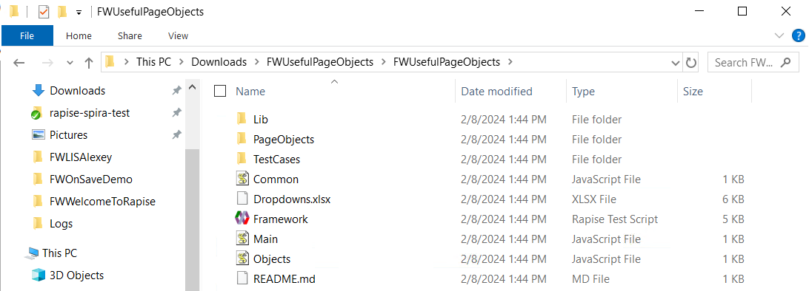
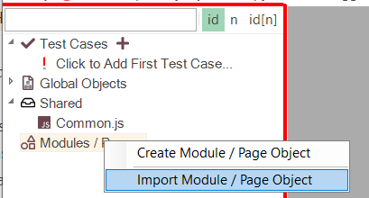
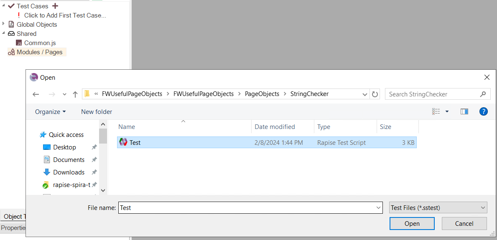
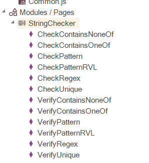

 [Download Now](https://inflectra.github.io/DownGit/#/home?url=https://github.com/Inflectra/rapise-powerpack/tree/master/FWUsefulPageObjects )

# Useful Page Objects

This Framework contains a number of useful general purpose Page Objects that may be used in different projects:

1. KeyboardHelper
2. ListChecker
3. ManagedHelper
4. StringChecker
5. TableHandler
6. WebPageHelper
7. ExtentReports
8. PDF
9. Playwright

## How to Use

1. [Download](https://inflectra.github.io/DownGit/#/home?url=https://github.com/Inflectra/rapise-powerpack/tree/master/FWUsefulPageObjects ) framework using the link in the beginning.

2. Unzip.

3. Go to your testing framework and choose "Import Page Object"

4. Browse to the folder with FWUsefulPageObjects, go into PageObjects subfolder and select a page object you want to add to your framework:

5. Once import is done you should see a selected Page Object in the tree:

You may import as many objects as needed this way. If an object was modified externally, you may remove it from your framework using "Delete", then download & unzip a fresh version and import again.

This way you may also import Page Objects from your own other testing frameworks.
