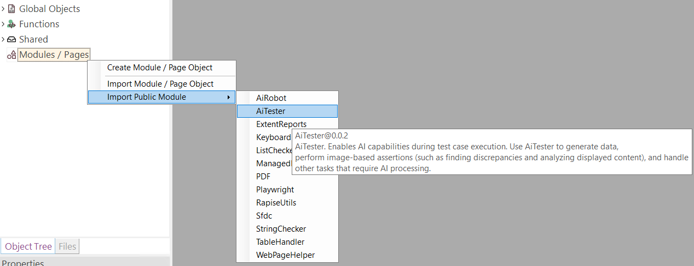
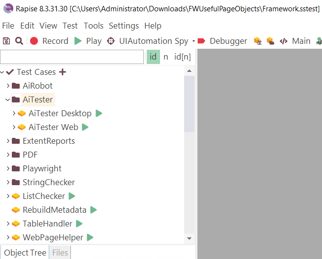

 [Download Now](https://inflectra.github.io/DownGit/#/home?url=https://github.com/Inflectra/rapise-powerpack/tree/master/FWUsefulPageObjects )

# Useful Modules

This Framework contains a number of useful general purpose Modules that may be used in different projects:

1. [KeyboardHelper](https://github.com/Inflectra/rapise-powerpack/tree/master/FWUsefulPageObjects/PageObjects/KeyboardHelper/README.md)
2. [ListChecker](https://github.com/Inflectra/rapise-powerpack/tree/master/FWUsefulPageObjects/PageObjects/ListChecker/README.md)
3. [ManagedHelper](https://github.com/Inflectra/rapise-powerpack/tree/master/FWUsefulPageObjects/PageObjects/ManagedHelper/README.md)
4. [StringChecker](https://github.com/Inflectra/rapise-powerpack/tree/master/FWUsefulPageObjects/PageObjects/StringChecker/README.md)
5. [TableHandler](https://github.com/Inflectra/rapise-powerpack/tree/master/FWUsefulPageObjects/PageObjects/TableHandler/README.md)
6. [WebPageHelper](https://github.com/Inflectra/rapise-powerpack/tree/master/FWUsefulPageObjects/PageObjects/WebPageHelper/README.md)
7. [ExtentReports](https://www.inflectra.com/Support/KnowledgeBase/KB861.aspx)
8. [PDF](https://github.com/Inflectra/rapise-powerpack/tree/master/FWUsefulPageObjects/PageObjects/PDF/README.md)
9. [Playwright](https://www.inflectra.com/Support/KnowledgeBase/KB880.aspx)
10. [Sfdc](https://github.com/Inflectra/rapise-powerpack/tree/master/FWUsefulPageObjects/PageObjects/Sfdc/README.md)
11. [RapiseUtils](https://www.inflectra.com/Support/KnowledgeBase/KB894.aspx)
12. [AiRobot](https://www.inflectra.com/Support/KnowledgeBase/KB884.aspx)
13. [AiTester](https://www.inflectra.com/Support/KnowledgeBase/KB883.aspx)
14. [TestRunner](https://www.inflectra.com/Support/KnowledgeBase/KB893.aspx)
15. [CmdHelper](https://github.com/Inflectra/rapise-powerpack/tree/master/FWUsefulPageObjects/PageObjects/CmdHelper/README.md)

## How to Use

From the Modules / Pages node context menu, choose **Import Public Module** and then choose the module

You may import as many objects as needed this way. If an object was modified externally, you may remove it from your framework using "Delete", then download & unzip a fresh version and import again.

This way you may also import Page Objects from your own other testing frameworks.

## Examples

[Download](https://inflectra.github.io/DownGit/#/home?url=https://github.com/Inflectra/rapise-powerpack/tree/master/FWUsefulPageObjects) this framework and open it in Rapise. It contains examples for each of the page objects.

