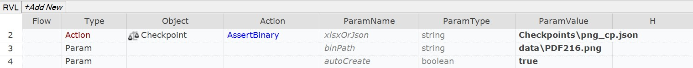

 [Download Now](https://inflectra.github.io/DownGit/#/home?url=https://github.com/Inflectra/rapise-powerpack/tree/master/FileCompare)

# File Checkpoints for Rapise

This sample contains a library for doing file checkpoints for the following types of objects:

1. String
2. Text File
2. Binary File
3. PDF File

It is all done via set of methods of the `Checkpoint` global object:


When checkpoint finds inconsistency in the file it is reported like that:


## Checkpoint formats

Checkpoint definition may come in 3 formats:
1. JSON
2. Excel
3. Plain text

Each has similar structure:
```javascript
	"data": [
        ...
		{
			"n": "001", // Line number
			"c": 1, 		// 1 - check this line, 0 - ignore this line
			"r": 0,			// 0 - treat 't' as a text for exact comparison. 1 - '1' is a regular expression
			"t": "Book Management"	// plain text or regular expression (depends on 'r').
		},
        ...
    }
```

The same checkpoint element has very similar look in Excel format:


And in plain text format:


The format is automatically derived from the file extension: `.json`, `.xlsx` or `.txt` correspondingly.

## Checkpoint creation

A checkpoint is supposed to be automatically generated by `Checkpoint` object and then manually modified to meet user's needs.

Simplest way to create a checkpoint is to pass `autoCreate=true` to any of the assertion methods, i.e.:

```javascript
    /* Validate invoice.txt with checkpoint.json.
     * if checkopint.json is not yet available, 
     * create a new one based on current contents
     * of the invoice.txt.
     */
	Checkpoint.AssertTextFile('checkpoint.json', 'invoice.txt', true);
```

First call to this method would create a new checkpoint file `%WORKDIR%\checkpoint.json`. You may tweak it later.

Sometimes you may need more control over checkpoint creation. For example, you want it to use regular expressions by default and read a text file in UTF8 format instead of default ASCII. In this case you may use the following special method:

```javascript
Checkpoint.CreateFromTextFile( 'checkoint.json', 'invoice.txt', /*asUtf8*/true, /**regex*/true);
```

## Binary Files

You may create a binary checkpoint to compare a file of any kind (i.e. image files). Binary checkpoint converts binary file to a hex text file, 16 bytes per line and then does a text file comparison.

```
1;0;001;89 50 4E 47 0D 0A 1A 0A 00 00 00 0D 49 48 44 52
1;0;002;00 00 00 10 00 00 00 10 08 06 00 00 00 1F F3 FF
..
1;0;022;44 AE 42 60 82
```

> **Note:** If your actual goal is to compare image files and see the difference, consider [Tester.AssertImage](https://rapisedoc.inflectra.com/Libraries/Tester/#assertimage) instead because it will also show the difference in a visual form.

# Using

To add a `Checkpoint` object into your framework simply copy or merge the [Lib](Lib) folder into your framework root.

> **Note:** You may change implementation of PDF reader used by the checkpoint library by defining a function implementation: `global.GetPdfFileFullText = function(/**string*/path) {/**TODO*/; return pdfText;}`

# Using with RVL

An example below compares file `data\PDF216.png` with checkpoint `%WORKDIR%\Checkpoints\png_cp.json`. If Checkpoint file is not found, it is created.

