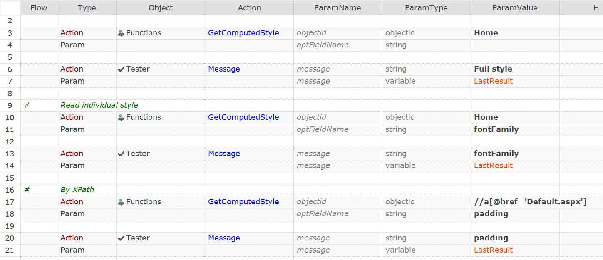

 [Download Now](https://inflectra.github.io/DownGit/#/home?url=https://github.com/Inflectra/rapise-powerpack/tree/master/GetComputedStyle)

# Get Computed Web Element Style

This sample defines a function:
```javascript
function GetComputedStyle(/**objectid*/objectid,/**string*/optFieldName)
```
Note, that this way we get properties of style javascript object, not the source CSS properties. Leave `optFieldName` empty to read all properties. Or specify property object name.

i.e. when you have something like:
```css
text-align: left;
```

Corresponding object property is:
```json
...
	"textAlign":"left"
...
```

Here is an example list of know style properties:

```json
{
	"accentColor": "auto",
	"additiveSymbols": "",
	"alignContent": "normal",
	"alignItems": "normal",
	"alignSelf": "auto",
	"alignmentBaseline": "auto",
	"all": "",
	"animation": "none 0s ease 0s 1 normal none running",
	"animationComposition": "replace",
	"animationDelay": "0s",
	"animationDirection": "normal",
	"animationDuration": "0s",
	"animationFillMode": "none",
	"animationIterationCount": "1",
	"animationName": "none",
	"animationPlayState": "running",
	"animationRange": "normal",
	"animationRangeEnd": "normal",
	"animationRangeStart": "normal",
	"animationTimeline": "auto",
	"animationTimingFunction": "ease",
	"appRegion": "none",
	"appearance": "none",
	"ascentOverride": "",
	"aspectRatio": "auto",
	"backdropFilter": "none",
	"backfaceVisibility": "visible",
	"background": "rgb(70, 92, 113) none repeat scroll 0% 0% / auto padding-box border-box",
	"backgroundAttachment": "scroll",
	"backgroundBlendMode": "normal",
	"backgroundClip": "border-box",
	"backgroundColor": "rgb(70, 92, 113)",
	"backgroundImage": "none",
	"backgroundOrigin": "padding-box",
	"backgroundPosition": "0% 0%",
	"backgroundPositionX": "0%",
	"backgroundPositionY": "0%",
	"backgroundRepeat": "repeat",
	"backgroundRepeatX": "repeat",
	"backgroundRepeatY": "repeat",
	"backgroundSize": "auto",
	"basePalette": "",
	"baselineShift": "0px",
	"baselineSource": "auto",
	"blockSize": "17.2708px",
	"border": "0.666667px solid rgb(78, 102, 125)",
	"borderBlock": "0.666667px solid rgb(78, 102, 125)",
	"borderBlockColor": "rgb(78, 102, 125)",
	"borderBlockEnd": "0.666667px solid rgb(78, 102, 125)",
	"borderBlockEndColor": "rgb(78, 102, 125)",
	"borderBlockEndStyle": "solid",
	"borderBlockEndWidth": "0.666667px",
	"borderBlockStart": "0.666667px solid rgb(78, 102, 125)",
	"borderBlockStartColor": "rgb(78, 102, 125)",
	"borderBlockStartStyle": "solid",
	"borderBlockStartWidth": "0.666667px",
	"borderBlockStyle": "solid",
	"borderBlockWidth": "0.666667px",
	"borderBottom": "0.666667px solid rgb(78, 102, 125)",
	"borderBottomColor": "rgb(78, 102, 125)",
	"borderBottomLeftRadius": "0px",
	"borderBottomRightRadius": "0px",
	"borderBottomStyle": "solid",
	"borderBottomWidth": "0.666667px",
	"borderCollapse": "separate",
	"borderColor": "rgb(78, 102, 125)",
	"borderEndEndRadius": "0px",
	"borderEndStartRadius": "0px",
	"borderImage": "none",
	"borderImageOutset": "0",
	"borderImageRepeat": "stretch",
	"borderImageSlice": "100%",
	"borderImageSource": "none",
	"borderImageWidth": "1",
	"borderInline": "0.666667px solid rgb(78, 102, 125)",
	"borderInlineColor": "rgb(78, 102, 125)",
	"borderInlineEnd": "0.666667px solid rgb(78, 102, 125)",
	"borderInlineEndColor": "rgb(78, 102, 125)",
	"borderInlineEndStyle": "solid",
	"borderInlineEndWidth": "0.666667px",
	"borderInlineStart": "0.666667px solid rgb(78, 102, 125)",
	"borderInlineStartColor": "rgb(78, 102, 125)",
	"borderInlineStartStyle": "solid",
	"borderInlineStartWidth": "0.666667px",
	"borderInlineStyle": "solid",
	"borderInlineWidth": "0.666667px",
	"borderLeft": "0.666667px solid rgb(78, 102, 125)",
	"borderLeftColor": "rgb(78, 102, 125)",
	"borderLeftStyle": "solid",
	"borderLeftWidth": "0.666667px",
	"borderRadius": "0px",
	"borderRight": "0.666667px solid rgb(78, 102, 125)",
	"borderRightColor": "rgb(78, 102, 125)",
	"borderRightStyle": "solid",
	"borderRightWidth": "0.666667px",
	"borderSpacing": "0px 0px",
	"borderStartEndRadius": "0px",
	"borderStartStartRadius": "0px",
	"borderStyle": "solid",
	"borderTop": "0.666667px solid rgb(78, 102, 125)",
	"borderTopColor": "rgb(78, 102, 125)",
	"borderTopLeftRadius": "0px",
	"borderTopRightRadius": "0px",
	"borderTopStyle": "solid",
	"borderTopWidth": "0.666667px",
	"borderWidth": "0.666667px",
	"bottom": "auto",
	"boxShadow": "none",
	"boxSizing": "content-box",
	"breakAfter": "auto",
	"breakBefore": "auto",
	"breakInside": "auto",
	"bufferedRendering": "auto",
	"captionSide": "top",
	"caretColor": "rgb(221, 228, 236)",
	"clear": "none",
	"clip": "auto",
	"clipPath": "none",
	"clipRule": "nonzero",
	"color": "rgb(221, 228, 236)",
	"colorInterpolation": "srgb",
	"colorInterpolationFilters": "linearrgb",
	"colorRendering": "auto",
	"colorScheme": "normal",
	"columnCount": "auto",
	"columnFill": "balance",
	"columnGap": "normal",
	"columnRule": "0px none rgb(221, 228, 236)",
	"columnRuleColor": "rgb(221, 228, 236)",
	"columnRuleStyle": "none",
	"columnRuleWidth": "0px",
	"columnSpan": "none",
	"columnWidth": "auto",
	"columns": "auto auto",
	"contain": "none",
	"containIntrinsicBlockSize": "none",
	"containIntrinsicHeight": "none",
	"containIntrinsicInlineSize": "none",
	"containIntrinsicSize": "none",
	"containIntrinsicWidth": "none",
	"container": "none",
	"containerName": "none",
	"containerType": "normal",
	"content": "normal",
	"contentVisibility": "visible",
	"counterIncrement": "none",
	"counterReset": "none",
	"counterSet": "none",
	"cursor": "pointer",
	"cx": "0px",
	"cy": "0px",
	"d": "none",
	"descentOverride": "",
	"direction": "ltr",
	"display": "block",
	"dominantBaseline": "auto",
	"emptyCells": "show",
	"fallback": "",
	"fill": "rgb(0, 0, 0)",
	"fillOpacity": "1",
	"fillRule": "nonzero",
	"filter": "none",
	"flex": "0 1 auto",
	"flexBasis": "auto",
	"flexDirection": "row",
	"flexFlow": "row nowrap",
	"flexGrow": "0",
	"flexShrink": "1",
	"flexWrap": "nowrap",
	"float": "none",
	"floodColor": "rgb(0, 0, 0)",
	"floodOpacity": "1",
	"font": "12.8px / 17.28px \"Helvetica Neue\", \"Lucida Grande\", \"Segoe UI\", Arial, Helvetica, Verdana, sans-serif",
	"fontDisplay": "",
	"fontFamily": "\"Helvetica Neue\", \"Lucida Grande\", \"Segoe UI\", Arial, Helvetica, Verdana, sans-serif",
	"fontFeatureSettings": "normal",
	"fontKerning": "auto",
	"fontOpticalSizing": "auto",
	"fontPalette": "normal",
	"fontSize": "12.8px",
	"fontStretch": "100%",
	"fontStyle": "normal",
	"fontSynthesis": "weight style small-caps",
	"fontSynthesisSmallCaps": "auto",
	"fontSynthesisStyle": "auto",
	"fontSynthesisWeight": "auto",
	"fontVariant": "normal",
	"fontVariantAlternates": "normal",
	"fontVariantCaps": "normal",
	"fontVariantEastAsian": "normal",
	"fontVariantLigatures": "normal",
	"fontVariantNumeric": "normal",
	"fontVariationSettings": "normal",
	"fontWeight": "400",
	"forcedColorAdjust": "auto",
	"gap": "normal",
	"grid": "none / none / none / row / auto / auto",
	"gridArea": "auto / auto / auto / auto",
	"gridAutoColumns": "auto",
	"gridAutoFlow": "row",
	"gridAutoRows": "auto",
	"gridColumn": "auto / auto",
	"gridColumnEnd": "auto",
	"gridColumnGap": "normal",
	"gridColumnStart": "auto",
	"gridGap": "normal normal",
	"gridRow": "auto / auto",
	"gridRowEnd": "auto",
	"gridRowGap": "normal",
	"gridRowStart": "auto",
	"gridTemplate": "none / none / none",
	"gridTemplateAreas": "none",
	"gridTemplateColumns": "none",
	"gridTemplateRows": "none",
	"height": "17.2708px",
	"hyphenateCharacter": "auto",
	"hyphenateLimitChars": "auto",
	"hyphens": "manual",
	"imageOrientation": "from-image",
	"imageRendering": "auto",
	"inherits": "",
	"initialLetter": "normal",
	"initialValue": "",
	"inlineSize": "34.3125px",
	"inset": "auto",
	"insetBlock": "auto",
	"insetBlockEnd": "auto",
	"insetBlockStart": "auto",
	"insetInline": "auto",
	"insetInlineEnd": "auto",
	"insetInlineStart": "auto",
	"isolation": "auto",
	"justifyContent": "normal",
	"justifyItems": "normal",
	"justifySelf": "auto",
	"left": "auto",
	"letterSpacing": "normal",
	"lightingColor": "rgb(255, 255, 255)",
	"lineBreak": "auto",
	"lineGapOverride": "",
	"lineHeight": "17.28px",
	"listStyle": "outside none none",
	"listStyleImage": "none",
	"listStylePosition": "outside",
	"listStyleType": "none",
	"margin": "0px",
	"marginBlock": "0px",
	"marginBlockEnd": "0px",
	"marginBlockStart": "0px",
	"marginBottom": "0px",
	"marginInline": "0px",
	"marginInlineEnd": "0px",
	"marginInlineStart": "0px",
	"marginLeft": "0px",
	"marginRight": "0px",
	"marginTop": "0px",
	"marker": "none",
	"markerEnd": "none",
	"markerMid": "none",
	"markerStart": "none",
	"mask": "none",
	"maskType": "luminance",
	"mathDepth": "0",
	"mathShift": "normal",
	"mathStyle": "normal",
	"maxBlockSize": "none",
	"maxHeight": "none",
	"maxInlineSize": "none",
	"maxWidth": "none",
	"minBlockSize": "0px",
	"minHeight": "0px",
	"minInlineSize": "0px",
	"minWidth": "0px",
	"mixBlendMode": "normal",
	"negative": "",
	"objectFit": "fill",
	"objectPosition": "50% 50%",
	"objectViewBox": "none",
	"offset": "none 0px auto 0deg",
	"offsetAnchor": "auto",
	"offsetDistance": "0px",
	"offsetPath": "none",
	"offsetPosition": "auto",
	"offsetRotate": "auto 0deg",
	"opacity": "1",
	"order": "0",
	"orphans": "2",
	"outline": "rgb(221, 228, 236) none 0px",
	"outlineColor": "rgb(221, 228, 236)",
	"outlineOffset": "0px",
	"outlineStyle": "none",
	"outlineWidth": "0px",
	"overflow": "visible",
	"overflowAnchor": "auto",
	"overflowClipMargin": "0px",
	"overflowWrap": "normal",
	"overflowX": "visible",
	"overflowY": "visible",
	"overrideColors": "",
	"overscrollBehavior": "auto",
	"overscrollBehaviorBlock": "auto",
	"overscrollBehaviorInline": "auto",
	"overscrollBehaviorX": "auto",
	"overscrollBehaviorY": "auto",
	"pad": "",
	"padding": "4px 20px",
	"paddingBlock": "4px",
	"paddingBlockEnd": "4px",
	"paddingBlockStart": "4px",
	"paddingBottom": "4px",
	"paddingInline": "20px",
	"paddingInlineEnd": "20px",
	"paddingInlineStart": "20px",
	"paddingLeft": "20px",
	"paddingRight": "20px",
	"paddingTop": "4px",
	"page": "auto",
	"pageBreakAfter": "auto",
	"pageBreakBefore": "auto",
	"pageBreakInside": "auto",
	"pageOrientation": "",
	"paintOrder": "normal",
	"perspective": "none",
	"perspectiveOrigin": "37.8229px 13.3021px",
	"placeContent": "normal",
	"placeItems": "normal",
	"placeSelf": "auto",
	"pointerEvents": "auto",
	"position": "static",
	"prefix": "",
	"quotes": "auto",
	"r": "0px",
	"range": "",
	"resize": "none",
	"right": "auto",
	"rotate": "none",
	"rowGap": "normal",
	"rubyPosition": "over",
	"rx": "auto",
	"ry": "auto",
	"scale": "none",
	"scrollBehavior": "auto",
	"scrollMargin": "0px",
	"scrollMarginBlock": "0px",
	"scrollMarginBlockEnd": "0px",
	"scrollMarginBlockStart": "0px",
	"scrollMarginBottom": "0px",
	"scrollMarginInline": "0px",
	"scrollMarginInlineEnd": "0px",
	"scrollMarginInlineStart": "0px",
	"scrollMarginLeft": "0px",
	"scrollMarginRight": "0px",
	"scrollMarginTop": "0px",
	"scrollPadding": "auto",
	"scrollPaddingBlock": "auto",
	"scrollPaddingBlockEnd": "auto",
	"scrollPaddingBlockStart": "auto",
	"scrollPaddingBottom": "auto",
	"scrollPaddingInline": "auto",
	"scrollPaddingInlineEnd": "auto",
	"scrollPaddingInlineStart": "auto",
	"scrollPaddingLeft": "auto",
	"scrollPaddingRight": "auto",
	"scrollPaddingTop": "auto",
	"scrollSnapAlign": "none",
	"scrollSnapStop": "normal",
	"scrollSnapType": "none",
	"scrollTimeline": "none",
	"scrollTimelineAxis": "block",
	"scrollTimelineName": "none",
	"scrollbarGutter": "auto",
	"shapeImageThreshold": "0",
	"shapeMargin": "0px",
	"shapeOutside": "none",
	"shapeRendering": "auto",
	"size": "",
	"sizeAdjust": "",
	"speak": "normal",
	"speakAs": "",
	"src": "",
	"stopColor": "rgb(0, 0, 0)",
	"stopOpacity": "1",
	"stroke": "none",
	"strokeDasharray": "none",
	"strokeDashoffset": "0px",
	"strokeLinecap": "butt",
	"strokeLinejoin": "miter",
	"strokeMiterlimit": "4",
	"strokeOpacity": "1",
	"strokeWidth": "1px",
	"suffix": "",
	"symbols": "",
	"syntax": "",
	"system": "",
	"tabSize": "8",
	"tableLayout": "auto",
	"textAlign": "left",
	"textAlignLast": "auto",
	"textAnchor": "start",
	"textCombineUpright": "none",
	"textDecoration": "none solid rgb(221, 228, 236)",
	"textDecorationColor": "rgb(221, 228, 236)",
	"textDecorationLine": "none",
	"textDecorationSkipInk": "auto",
	"textDecorationStyle": "solid",
	"textDecorationThickness": "auto",
	"textEmphasis": "none rgb(221, 228, 236)",
	"textEmphasisColor": "rgb(221, 228, 236)",
	"textEmphasisPosition": "over",
	"textEmphasisStyle": "none",
	"textIndent": "0px",
	"textOrientation": "mixed",
	"textOverflow": "clip",
	"textRendering": "auto",
	"textShadow": "none",
	"textSizeAdjust": "auto",
	"textTransform": "none",
	"textUnderlineOffset": "auto",
	"textUnderlinePosition": "auto",
	"textWrap": "nowrap",
	"timelineScope": "none",
	"top": "auto",
	"touchAction": "auto",
	"transform": "none",
	"transformBox": "view-box",
	"transformOrigin": "37.8229px 13.3021px",
	"transformStyle": "flat",
	"transition": "all 0s ease 0s",
	"transitionDelay": "0s",
	"transitionDuration": "0s",
	"transitionProperty": "all",
	"transitionTimingFunction": "ease",
	"translate": "none",
	"unicodeBidi": "normal",
	"unicodeRange": "",
	"userSelect": "auto",
	"vectorEffect": "none",
	"verticalAlign": "baseline",
	"viewTimeline": "none",
	"viewTimelineAxis": "block",
	"viewTimelineInset": "0px",
	"viewTimelineName": "none",
	"viewTransitionName": "none",
	"visibility": "visible",
	"webkitAlignContent": "normal",
	"webkitAlignItems": "normal",
	"webkitAlignSelf": "auto",
	"webkitAnimation": "none 0s ease 0s 1 normal none running",
	"webkitAnimationDelay": "0s",
	"webkitAnimationDirection": "normal",
	"webkitAnimationDuration": "0s",
	"webkitAnimationFillMode": "none",
	"webkitAnimationIterationCount": "1",
	"webkitAnimationName": "none",
	"webkitAnimationPlayState": "running",
	"webkitAnimationTimingFunction": "ease",
	"webkitAppRegion": "none",
	"webkitAppearance": "none",
	"webkitBackfaceVisibility": "visible",
	"webkitBackgroundClip": "border-box",
	"webkitBackgroundOrigin": "padding-box",
	"webkitBackgroundSize": "auto",
	"webkitBorderAfter": "0.666667px solid rgb(78, 102, 125)",
	"webkitBorderAfterColor": "rgb(78, 102, 125)",
	"webkitBorderAfterStyle": "solid",
	"webkitBorderAfterWidth": "0.666667px",
	"webkitBorderBefore": "0.666667px solid rgb(78, 102, 125)",
	"webkitBorderBeforeColor": "rgb(78, 102, 125)",
	"webkitBorderBeforeStyle": "solid",
	"webkitBorderBeforeWidth": "0.666667px",
	"webkitBorderBottomLeftRadius": "0px",
	"webkitBorderBottomRightRadius": "0px",
	"webkitBorderEnd": "0.666667px solid rgb(78, 102, 125)",
	"webkitBorderEndColor": "rgb(78, 102, 125)",
	"webkitBorderEndStyle": "solid",
	"webkitBorderEndWidth": "0.666667px",
	"webkitBorderHorizontalSpacing": "0px",
	"webkitBorderImage": "none",
	"webkitBorderRadius": "0px",
	"webkitBorderStart": "0.666667px solid rgb(78, 102, 125)",
	"webkitBorderStartColor": "rgb(78, 102, 125)",
	"webkitBorderStartStyle": "solid",
	"webkitBorderStartWidth": "0.666667px",
	"webkitBorderTopLeftRadius": "0px",
	"webkitBorderTopRightRadius": "0px",
	"webkitBorderVerticalSpacing": "0px",
	"webkitBoxAlign": "stretch",
	"webkitBoxDecorationBreak": "slice",
	"webkitBoxDirection": "normal",
	"webkitBoxFlex": "0",
	"webkitBoxOrdinalGroup": "1",
	"webkitBoxOrient": "horizontal",
	"webkitBoxPack": "start",
	"webkitBoxReflect": "none",
	"webkitBoxShadow": "none",
	"webkitBoxSizing": "content-box",
	"webkitClipPath": "none",
	"webkitColumnBreakAfter": "auto",
	"webkitColumnBreakBefore": "auto",
	"webkitColumnBreakInside": "auto",
	"webkitColumnCount": "auto",
	"webkitColumnGap": "normal",
	"webkitColumnRule": "0px none rgb(221, 228, 236)",
	"webkitColumnRuleColor": "rgb(221, 228, 236)",
	"webkitColumnRuleStyle": "none",
	"webkitColumnRuleWidth": "0px",
	"webkitColumnSpan": "none",
	"webkitColumnWidth": "auto",
	"webkitColumns": "auto auto",
	"webkitFilter": "none",
	"webkitFlex": "0 1 auto",
	"webkitFlexBasis": "auto",
	"webkitFlexDirection": "row",
	"webkitFlexFlow": "row nowrap",
	"webkitFlexGrow": "0",
	"webkitFlexShrink": "1",
	"webkitFlexWrap": "nowrap",
	"webkitFontFeatureSettings": "normal",
	"webkitFontSmoothing": "auto",
	"webkitHighlight": "none",
	"webkitHyphenateCharacter": "auto",
	"webkitJustifyContent": "normal",
	"webkitLineBreak": "auto",
	"webkitLineClamp": "none",
	"webkitLocale": "auto",
	"webkitLogicalHeight": "17.2708px",
	"webkitLogicalWidth": "34.3125px",
	"webkitMarginAfter": "0px",
	"webkitMarginBefore": "0px",
	"webkitMarginEnd": "0px",
	"webkitMarginStart": "0px",
	"webkitMask": "",
	"webkitMaskBoxImage": "none",
	"webkitMaskBoxImageOutset": "0",
	"webkitMaskBoxImageRepeat": "stretch",
	"webkitMaskBoxImageSlice": "0 fill",
	"webkitMaskBoxImageSource": "none",
	"webkitMaskBoxImageWidth": "auto",
	"webkitMaskClip": "border-box",
	"webkitMaskComposite": "source-over",
	"webkitMaskImage": "none",
	"webkitMaskOrigin": "border-box",
	"webkitMaskPosition": "0% 0%",
	"webkitMaskPositionX": "0%",
	"webkitMaskPositionY": "0%",
	"webkitMaskRepeat": "repeat",
	"webkitMaskRepeatX": "",
	"webkitMaskRepeatY": "",
	"webkitMaskSize": "auto",
	"webkitMaxLogicalHeight": "none",
	"webkitMaxLogicalWidth": "none",
	"webkitMinLogicalHeight": "0px",
	"webkitMinLogicalWidth": "0px",
	"webkitOpacity": "1",
	"webkitOrder": "0",
	"webkitPaddingAfter": "4px",
	"webkitPaddingBefore": "4px",
	"webkitPaddingEnd": "20px",
	"webkitPaddingStart": "20px",
	"webkitPerspective": "none",
	"webkitPerspectiveOrigin": "37.8229px 13.3021px",
	"webkitPerspectiveOriginX": "",
	"webkitPerspectiveOriginY": "",
	"webkitPrintColorAdjust": "economy",
	"webkitRtlOrdering": "logical",
	"webkitRubyPosition": "before",
	"webkitShapeImageThreshold": "0",
	"webkitShapeMargin": "0px",
	"webkitShapeOutside": "none",
	"webkitTapHighlightColor": "rgba(0, 0, 0, 0.18)",
	"webkitTextCombine": "none",
	"webkitTextDecorationsInEffect": "none",
	"webkitTextEmphasis": "none rgb(221, 228, 236)",
	"webkitTextEmphasisColor": "rgb(221, 228, 236)",
	"webkitTextEmphasisPosition": "over",
	"webkitTextEmphasisStyle": "none",
	"webkitTextFillColor": "rgb(221, 228, 236)",
	"webkitTextOrientation": "vertical-right",
	"webkitTextSecurity": "none",
	"webkitTextSizeAdjust": "auto",
	"webkitTextStroke": "",
	"webkitTextStrokeColor": "rgb(221, 228, 236)",
	"webkitTextStrokeWidth": "0px",
	"webkitTransform": "none",
	"webkitTransformOrigin": "37.8229px 13.3021px",
	"webkitTransformOriginX": "",
	"webkitTransformOriginY": "",
	"webkitTransformOriginZ": "",
	"webkitTransformStyle": "flat",
	"webkitTransition": "all 0s ease 0s",
	"webkitTransitionDelay": "0s",
	"webkitTransitionDuration": "0s",
	"webkitTransitionProperty": "all",
	"webkitTransitionTimingFunction": "ease",
	"webkitUserDrag": "auto",
	"webkitUserModify": "read-only",
	"webkitUserSelect": "auto",
	"webkitWritingMode": "horizontal-tb",
	"whiteSpace": "nowrap",
	"whiteSpaceCollapse": "collapse",
	"widows": "2",
	"width": "34.3125px",
	"willChange": "auto",
	"wordBreak": "normal",
	"wordSpacing": "0px",
	"wordWrap": "normal",
	"writingMode": "horizontal-tb",
	"x": "0px",
	"y": "0px",
	"zIndex": "auto",
	"zoom": "1"
} 
```

## Using

Add contents of [User.js](User.js) into your test's `User.js`.

## Using with JS

```javascript
	Navigator.Open("https://libraryinformationsystem.org/");

	var styleObj = GetComputedStyle("Home");
	Tester.Message("Full Style from from JS",JSON.stringify(styleObj));
	
	var styleValue = GetComputedStyle("Home", "textAlign");
	Tester.Message("textAlign property from JS: ",JSON.stringify(styleValue));

	var styleValue = GetComputedStyle("//a[@href='Default.aspx']", "textAnchor");
	Tester.Message("textAnchor property from JS (and element XPath)",JSON.stringify(styleValue));
```

## Using with RVL

