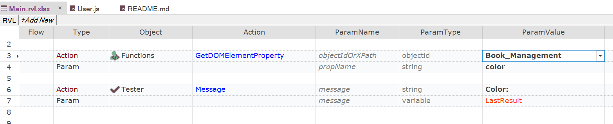

 [Download Now](https://inflectra.github.io/DownGit/#/home?url=https://github.com/Inflectra/rapise-powerpack/tree/master/GetDOMElementProperty)


# Reading DOM Element Property

Sometimes we need to get runtime property for the element. For example, we need to get a background color to know that element is highlighted for a user. Anything configured via stylesheet is usually a property: color, font, margins, dimensions, visibility etc.

You may do it using a number of lower level functions as it is described here (https://www.inflectra.com/Support/KnowledgeBase/KB631.aspx).

In this article we use a function
```javascript
GetDOMElementProperty(/**objectId*/objectIdOrXPath, /**string*/propName)
```

That may be called from RVL like that:



# How to Use

Copy contents of `GetDOMElementProperty` from [User.js](User.js) file and call it from RVL or JavaScript.