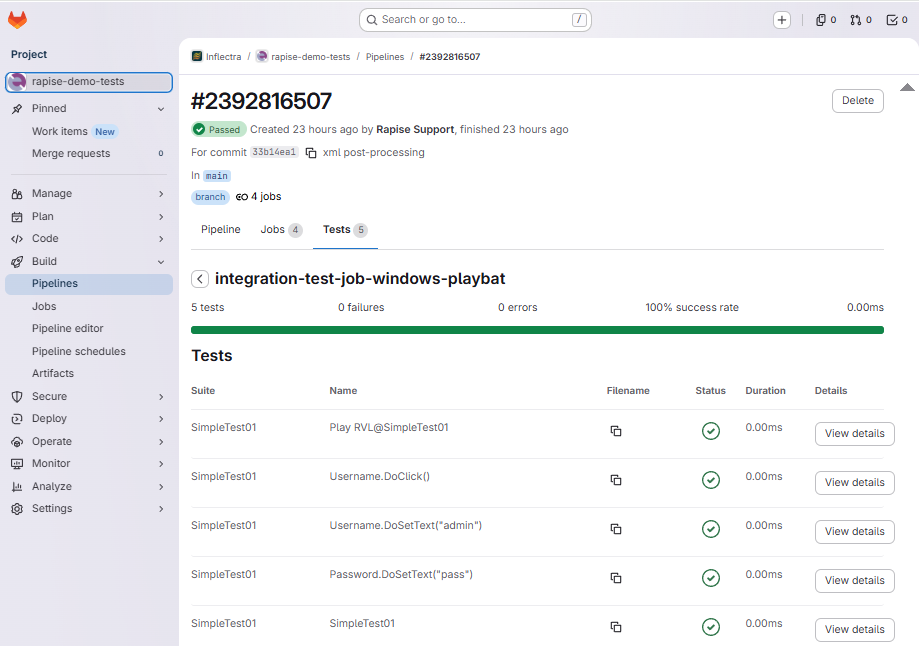

# Running Legacy Windows Tests using GitLab

This topic covers configuration similar to one described for [Jenkins](https://www.inflectra.com/Support/KnowledgeBase/KB827.aspx) integration. It uses legacy Rapise tests scripts using `play.cmd` and runs on the Windows VM with GitLab-Runner.

> **Note:** if you have Spira integration and Frameworks you have more simple and straight-forward way of doing the same, this topic is only for legacy test sets created with Rapise 7 or earlier.

This sample assumes that Rapise is already installed and tests are already downloaded into `c:\SpiraRepository`.

GitLab-Runner has `config.toml` like that running on the Windows Host:

```toml
[[runners]]
name = "w25"
url = "https://gitlab.com"
executor = "shell"
shell = "powershell"
```

The host has a tag `windows-w25`. Then the job has definition like that:

```yaml
stages:
  - integration

variables:
  GITROOT: $CI_PROJECT_DIR

integration-test-job-windows-selfhosted-playbat:  # Runs Rapise tests via play.cmd, publishes TAP + TRP artifacts
  stage: integration
  tags:
    - windows-w25
  when: manual
  script:
    - npm install -g tap-junit
    - |
      $tests = @(
        "C:\SpiraRepository\SimpleTest01",
        "C:\SpiraRepository\SimpleTest02"
      )
      foreach ($TEST_DIR in $tests) {
        $name = Split-Path $TEST_DIR -Leaf
        Write-Host "========== Running $name =========="
        Remove-Item -Recurse -Force "$TEST_DIR\Reports" -ErrorAction SilentlyContinue
        & "$TEST_DIR\play.cmd"
        $xml = (Get-Content "$TEST_DIR\last.tap" | tap-junit --suite $name) -join "`n"
        # Inject classname attribute required by GitLab's JUnit parser
        $xml = $xml -replace '(<testcase\s)', ('<testcase classname="' + $name + '" ')
        $utf8NoBOM = [System.Text.UTF8Encoding]::new($false)
        [System.IO.File]::WriteAllText("$TEST_DIR\junit-results.xml", $xml, $utf8NoBOM)
        # Copy results into project dir so GitLab runner can collect them as artifacts
        $dest = "$env:CI_PROJECT_DIR\test-results\$name"
        New-Item -ItemType Directory -Force -Path $dest | Out-Null
        Copy-Item "$TEST_DIR\junit-results.xml" "$dest\"
        Copy-Item "$TEST_DIR\last.tap" "$dest\"
        Copy-Item "$TEST_DIR\*.trp" "$dest\" -ErrorAction SilentlyContinue
      }
  artifacts:
    when: always
    reports:
      junit:
        - "test-results/SimpleTest01/junit-results.xml"
        - "test-results/SimpleTest02/junit-results.xml"
    paths:
      - "test-results/"
    expire_in: 30 days
```

> **Note:** all test folders should be listed here twice:
> 1. In the `$tests =`
> 2. In the `artifacts` section.

The results of test execution then look like that:


