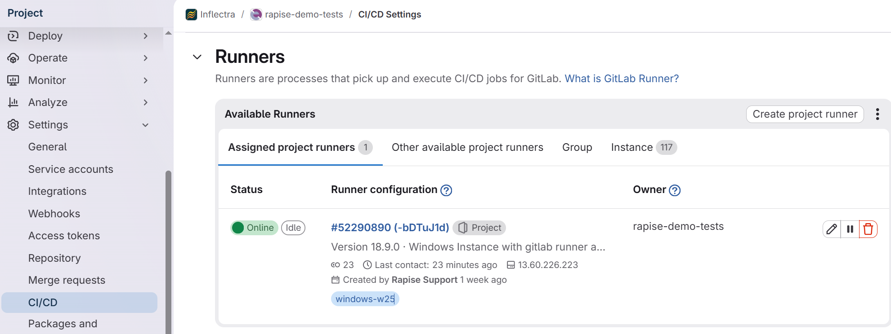

# Running Rapise Tests with GitLab CI/CD

This guide covers how to run Rapise automated tests from a GitLab pipeline. Unlike GitHub Actions, GitLab CI/CD does not have a marketplace of reusable actions — instead, everything is configured directly in `.gitlab-ci.yml`. GitLab does, however, natively support JUnit XML test reports, which lets you view test results directly in the pipeline UI.

All jobs in this repository are set to `when: manual` so they only run when explicitly triggered from the GitLab pipeline page.

---

## Approaches Covered

| Job | Runner | Engine |
|---|---|---|
| [Linux (Node.js)](#linux-nodejs-runner) | GitLab SaaS Linux | `rapiselauncher` (npm) |
| [Windows SaaS](#windows-saas-runner) | GitLab SaaS Windows | `rapiselauncher` (npm) |
| [Windows Self-Hosted (RapiseLauncher.exe)](#windows-self-hosted--rapiselauncher-exe) | Self-hosted Windows | Native `RapiseLauncher.exe` |

> **Legacy use-case** (self-hosted Windows desktop runner with `play.cmd`) is covered in a dedicated topic: [GitLabLegacy](https://github.com/Inflectra/rapise-powerpack/tree/master/GitLabLegacy).

---

## Prerequisites

- A Spira instance (SpiraTest / SpiraTeam / SpiraPlan) with an active user account.
- Test Sets in Spira configured to run automated Rapise tests.
- An Automation Host record created in Spira (e.g., named `GitLab`).
- A `RepositoryConnection.xml` file checked into your repository (or credentials passed via CI/CD variables).

## Storing Spira Credentials

Never put passwords or API keys directly in `.gitlab-ci.yml`. Use GitLab CI/CD Variables instead:

1. In Spira, go to **My Profile** and copy your **RSS Token**.
2. In your GitLab project, go to **Settings > CI/CD > Variables**.
3. Add a variable named `SPIRA_API_KEY` (mark it as **Masked**) and paste your token.

---

## Linux (Node.js) Runner

Runs on a standard GitLab SaaS Linux runner using the `node` Docker image. Rapise is installed via npm on every run.

```yaml
integration-test-job:
  stage: integration
  image: node
  when: manual
  script:
    - npm install https://inflectra-rapise-nightly-installers.s3.eu-north-1.amazonaws.com/Test/rapise-9.1.36.04.tgz
    - npx rapiselauncher -c RepositoryConnection.xml -t 1273 --details --param "g_browserLibrary=Selenium - ChromeHeadless" --report rapiselauncher-test-results.xml
  artifacts:
    when: always
    reports:
      junit:
        - "rapiselauncher-test-results.xml"
    paths:
      - "rapiselauncher-test-results.xml"
      - "**/*.log"
      - "**/*.tap"
      - "**/*.trp"
    expire_in: 30 days
```

Key points:
- `GITROOT` is set to `$CI_PROJECT_DIR` so Rapise can locate test files checked out from Git.
- `--report rapiselauncher-test-results.xml` produces a JUnit XML file that GitLab picks up under `reports.junit`.
- Always pass `g_browserLibrary=Selenium - ChromeHeadless` on headless Linux runners.
- Artifacts (logs, `.tap`, `.trp`) are retained for 30 days.

### Viewing Test Results in GitLab

Because the job publishes a JUnit report via `reports.junit`, GitLab displays per-test pass/fail results directly on the pipeline and merge request pages — no extra tooling needed.

<!-- PLACEHOLDER: screenshot of GitLab pipeline test results panel -->

---

## Windows SaaS Runner

Runs on a GitLab-managed Windows runner (`saas-windows-medium-amd64`). Node.js is installed via Chocolatey before running the launcher.

```yaml
integration-test-job-windows:
  stage: integration
  tags:
    - saas-windows-medium-amd64
  when: manual
  before_script:
    - choco install nodejs --version=22.22.1 -y
    - Import-Module "$env:ChocolateyInstall\helpers\chocolateyProfile.psm1"
    - Update-SessionEnvironment
  script:
    - npm install https://inflectra-rapise-nightly-installers.s3.eu-north-1.amazonaws.com/Rapise_9.0.35.31/rapise-9.0.35.31.tgz
    - npx rapiselauncher -c RepositoryConnectionWin.xml -t 1273 --details --param "g_browserLibrary=Selenium - ChromeHeadless"
```

Key points:
- `before_script` installs Node.js and refreshes the session PATH so `npm`/`npx` are available.
- Uses `RepositoryConnectionWin.xml` — a Windows-specific connection config (paths use backslashes).
- To publish JUnit results, add `--report rapiselauncher-test-results.xml` and the same `artifacts.reports.junit` block as the Linux job above.

---

## Windows Self-Hosted — RapiseLauncher.exe

Runs on a self-hosted Windows runner with Rapise already installed. Uses the native `RapiseLauncher.exe` directly.

```yaml
integration-test-job-windows-selfhosted-rapiselauncher:
  stage: integration
  tags:
    - windows-w25
  when: manual
  allow_failure: true
  script:
    - cmd.exe /c '"C:\Program Files (x86)\Inflectra\Rapise\bin\RapiseLauncher.exe" -testset:1273 "-report:%CI_PROJECT_DIR%\rapiselauncher-test-results.xml"'
  artifacts:
    when: always
    reports:
      junit:
        - "rapiselauncher-test-results.xml"
    paths:
      - "rapiselauncher-test-results.xml"
      - "**/*.log"
      - "**/*.tap"
      - "**/*.trp"
    expire_in: 30 days
```

Key points:
- Rapise must be pre-installed on the runner host.
- `-testset:1273` is the Spira Test Set ID to execute.
- `-report:` writes a JUnit XML file that GitLab collects as a test report.
- `allow_failure: true` prevents the pipeline from blocking on test failures while still recording results.
- The runner is identified by the `windows-w25` tag — adjust to match your runner's tag.

To set up a self-hosted runner, follow the GitLab docs: [Create a project runner with a runner authentication token](https://docs.gitlab.com/ci/runners/runners_scope/#create-a-project-runner-with-a-runner-authentication-token).



### Runner Configuration (`config.toml`)

```toml
[[runners]]
  name = "w25"
  url = "https://gitlab.com"
  executor = "shell"
  shell = "powershell"
```

---

## Viewing Test Results in GitLab

Any job that publishes a `reports.junit` artifact gets native test result integration in GitLab:

- **Pipeline view**: pass/fail counts shown on the pipeline summary.
- **Merge requests**: failed tests are highlighted directly in the MR.
- **Test detail**: click into a pipeline run to see individual test case results, durations, and failure messages.

<!-- PLACEHOLDER: screenshot of GitLab pipeline test results panel -->
<!-- PLACEHOLDER: screenshot of GitLab MR test results widget -->

---

## See Also

- [GitLabLegacy — self-hosted Windows desktop runner](https://github.com/Inflectra/rapise-powerpack/tree/master/GitLabLegacy)
- [rapiselauncher-node-action (GitHub Actions)](https://github.com/Inflectra/rapiselauncher-node-action) — cross-platform Node.js engine for GitHub Actions
- [rapiselauncher-win-action (GitHub Actions)](https://github.com/Inflectra/rapiselauncher-win-action) — native Windows engine for GitHub Actions
