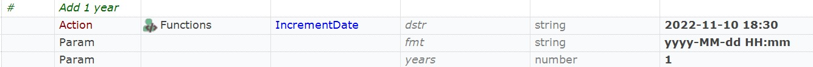
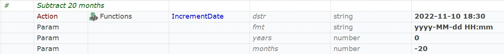
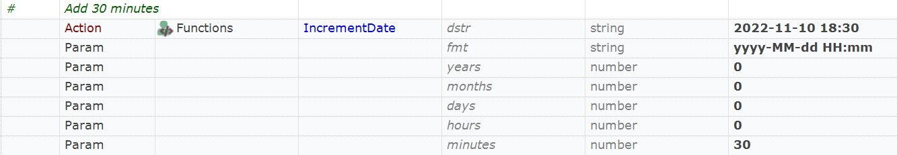

 [Download Now](https://inflectra.github.io/DownGit/#/home?url=https://github.com/Inflectra/rapise-powerpack/tree/master/IncrementDate)


# Parse & modify date

Suppose that you need to modify formatted date. I.e. you need to add 3 months to date:

2020-11-25 (+3 months = 2021-02-25).

This example contains a function `IncrementDate`:

```javascript
function IncrementDate(
	/**string*/dstr, 
	/**string*/fmt, 
	/**number*/years, 
	/**number*/months, 
	/**number*/days, 
	/**number*/hours, 
	/**number*/minutes)/**string*/
{}
```
Where:
* `dstr` - input date string, i.e. 2022-10-05
* `fmt` date format, i.e. `yyyy-MM-dd`. Full information on available date formatting options may be found here: https://learn.microsoft.com/en-us/previous-versions/dotnet/netframework-3.0/az4se3k1(v=vs.85)
* `years` to add/subtract. 0 - leave year as is. `2` - add two years, `-3` - subtract 3 years.
* `months` to add/subtract. Similar to years.
* `days` to add/subtract. Similar to years.
* `hours` to add/subtract. Similar to years.
* `minutes` to add/subtract. Similar to years.


## Using

Add contents of [User.js](User.js) into your test's `User.js`.


### In JavaScript

```javascript
    // Subtract 2 years
    IncrementDate("2022-11-10 18:30", "yyyy-MM-dd HH:mm", -2);
    // Add 2 months
    IncrementDate("2022-11-10 18:30", "yyyy-MM-dd HH:mm", 0, 2);
    // Add 20 minutes
    IncrementDate("2022-11-10 18:30", "yyyy-MM-dd HH:mm", 0, 0, 0, 0, 20);
```

### In RVL




