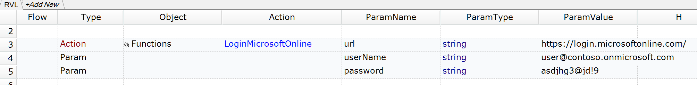

# LoginMicrosoftOnline

This function opens a browser at specified URL and performs login through Microsoft Online authentication UI.


## Usage

Copy the function to `*.user.js` file or any other common file you include in every test.

To wait until authentication is performed and Microsoft application (e.g. Office 365 or Dynamics 365) is completely initialized we recommend to use `Global.DoWaitFor` action after calling the function. Learn any UI element on the home page of the loaded application and pass it's ID do `DoWaitFor`:

```javascript
Global.DoWaitFor("HomePageElement", 60000);
```

## Demo

Here are examples of calling the function from JavaScript.

```javascript
LoginMicrosoftOnline("https://login.microsoftonline.com/", "user@contoso.onmicrosoft.com", "asdjhg3@jd!9");

LoginMicrosoftOnline("https://businesscentral.dynamics.com", "user@contoso.onmicrosoft.com", "asdjhg3@jd!9");

LoginMicrosoftOnline("https://contoso.crm.dynamics.com", "user@contoso.onmicrosoft.com", "asdjhg3@jd!9");
```

And this is the RVL usage example.



If you want to hide the password check this KB topic:

[Using Global.DoEncrypt and Global.DoDecrypt to Hide Passwords](https://www.inflectra.com/Support/KnowledgeBase/KB304.aspx)


