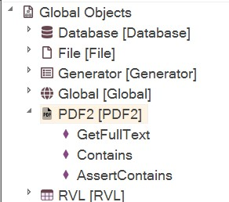

 [Download Now](https://inflectra.github.io/DownGit/#/home?url=https://github.com/Inflectra/rapise-powerpack/tree/master/PDFTextExtractV2)

# Convert PDF file to Text

This sample demonstrates one of the ways how to read text from PDF file using Rapise.

Sometimes you need to extract text information from the PDF document (invoice, order, confirmation) generated by your application.

  > Note, that this function uses well known [pdf.js](https://mozilla.github.io/pdf.js/) library and [pdf-parse](https://www.npmjs.com/package/pdf-parse) npm package.

`PDF2` object has following methods:

```javascript
function GetFullText(/**string*/pdfPath)
```
- returns PDF contents as text that you may use for further processing.
* *pdfPath* path to PDF file

```javascript
function Contains(/**string*/pdfPath, /**string*/textToFind)
```
- check presense of some string in PDF document.
* *pdfPath* path to PDF file
* *textToFind* substring to locate

```javascript
function AssertContains(/**string*/pdfPath, /**string*/textToFind, /**string*/assertionMessage)
```
- check presence of some string in PDF document and do report assertion.
* *pdfPath* path to PDF file
* *textToFind* substring to locate
* *assertionMessage* - optional assertion message to include into report.

## Usage 

Copy 'Lib' folder into your testing framework. Re-start Rapise. You should see `PDF2` object in the global objects tree.
