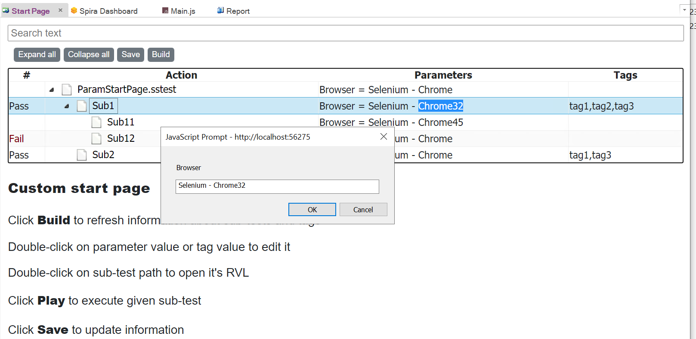

 [Download Now](https://inflectra.github.io/DownGit/#/home?url=https://github.com/Inflectra/rapise-powerpack/tree/master/ParamStartPage)

# Using Custom Start Page in Rapise

This is a sample framework showing how the Start page may be customized in Rapise. This custom start page may be used for the following:
1. Show information about all sub-tests, test test parameters (with Ask=true) and tags (press 'Build' button).
2. Edit sub-test parameters and tags (double-click on parameter value or tag).
3. Update tests with new information (press 'Save' button)



## Custom Start Page Features

The Start page may be designed as a web application packaged into the .zip file. This application may do the following:

1. Read files from current framework.
```javascript
$.ajax({
    url: `localdata/data.json`,
    success: function(paramdata) {
        console.log(`got data.json contents ${paramdata}`)
    },
    error: function(XMLHttpRequest, textStatus, errorThrown) { 
        console.log(`Error loading data.json`, textStatus);
    }
});

```
2. Write Files.
```javascript
$.ajax({
    url: `localdata/Lib/datafile.txt`,
    type: `POST`,
    data: `Some data to write`,
    success: function(paramdata) {
        console.log(`File upload succesfull`);
    }
});
```
3. Run custom entry point function in the Rapise test framework.
```javascript
            // Set entry point to invoke (function in the library) 
            window.location.href = `smartestudio:///?settestonetimeparam=g_entryPointName:'PSP_ApplyChanges'`;
            // Invoke the test with given entry point
            window.location.href = `smartestudio:///?playtest=`;
            console.log(`done calling PSP_ApplyChanges`);
```

4. Open a file in Rapise.
```javascript
window.location.href = `smartestudio:///?opentestfile=Main.rvl.xlsx`;
```

## Re-using in Other Frameworks

This start page may be applied to other testing frameworks as follows.
1. Put `rapise-start-page.zip` into your framework's root.
2. Copy `Lib` folder to your framework (it contains `LibParamStartPage` library having entry points `PSP_Build` and `PSP_ApplyChanges` used by the start page to Build and Save)

## Development

1. Unpack `rapise-start-page.zip` so that `StartPage.html` and `index.html` are in the root of your framework. Move `.zip` file away. In such case Rapise will load start page from `index.html`.
2. All logic is in the `index.html` - develop your custom start page there.
3. You may use `Ctrl+F12` in Rapise Start Page view. It will open Chromium development tools.
3. Once you are done, pack it back to `rapise-start-page.zip`.


## Reference Examples

Default start page is one more good example of Rapise start page capabilities. You may find it at `C:\Users\Public\Documents\Rapise\Help\rapise-start-page.zip`.