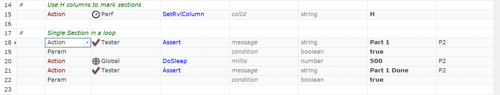

 [Download Now](https://inflectra.github.io/DownGit/#/home?url=https://github.com/Inflectra/rapise-powerpack/tree/master/PerfCheckerWithLib)


# Performance Checker

This package contains a library `LibPerf` that helps easily check operation performance.

Each piece of code is marked as a section. The section may be executed one or more times. All measurements are calculated and grouped by section name.

Then one may use assertion methods to check the performance, i.e.:

```javascript
Perf.AssertLast("SomeSection", 1000);
Perf.AssertMax("SomeSection", 1000);
Perf.AssertAvg("SomeSection", 1000);
```

There are 2 modes. 

## Explicit Mode

```javascript
Perf.BeginSection("Login");
...
...
Perf.EndSection();

Perfm.AssertLast("Login", 1000); // Assertion checker that last execution time is less than 1000ms
```

## RVL Column Mode


Use `Perf.SetRvlColumn("H")` and then mark section name in the 'H' column to collect performance metrics, i.e.:




## How to Use

Copy the whole folder `Lib` into your test framework (i.e. there should be `Lib` subfolder inside your tests root folder.

a) If you want to use columns, call `Perf.SetRvlColumn("H")` and then mark section names in the **H** column.

b) Or define sections explicitly using `Perf.BeginSection('SomeName')` / `Perf.EndSection()` pairs of calls.


With each of the methods above you may then check if performance fits certain metrics, i.e.:


