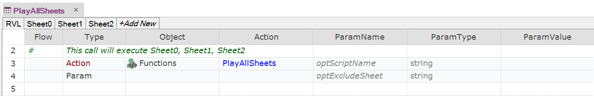

 [Download Now](https://inflectra.github.io/DownGit/#/home?url=https://github.com/Inflectra/rapise-powerpack/tree/master/PlayAllSheets)


# PlayAllSheets

This sample contains a function `PlayAllSheets` that may run all the sheets in the given RVL script one-by-one.

```javascript
/**
 * Play all sheets in the given RVL script one-by-one. When called form one of RVL
 * sheets without parameters, it calls all other sheets in the given RVL script.
 * @param {optScriptName} .rvl.xlsx script path. If empty, currently executed RVL script is used.
 * @param {optExcludeSheet} optional name of the sheet to exclude. May be empty together with `optScriptName`
 * @param optScriptName Path to a folder.
 */
function PlayAllSheets( /**string*/ optScriptName, /**string*/optExcludeSheet) 
```

## Using

Add contents of [User.js](User.js) into your test's `User.js`.

## Example: Calling from RVL




