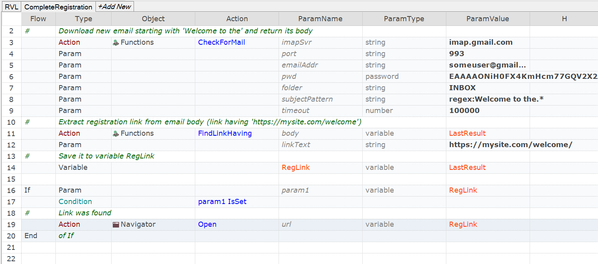

# Checking Email in Rapise
Here you can find simple utility function and method for using it.

## How to Use

You need to get contents of this folder into the root folder of the test so that CheckMail.bat is stored in the root of the tst.

## Using from RVL




## Function

The function searches inbox for an email message matching the specified pattern. 

````javascript
/**
 * Check speicified mailbox for a new mail message. We only check unread messages and
 * found messages are marked as read.
 *
 * If message is found then its body text is returned.
 *
 * Please, note that for Gmail mailbox you need to set "Allow less secure apps: ON"
 */
function CheckForMail(
	/**string*/imapSvr, 
	/**string*/port, 
	/**string*/emailAddr, 
	/**string*/pwd,
	/**string*/folder,
	/**string*/subjectPattern,
	/**number*/timeout)
````


## Command Line Utility

The function calls a command line utility attached here as an executable.

The command line utility is needed to access IMAP inbox and read an incoming email


````
RapiseImapClient.exe
Rapise Email Reader
Usage:
RapiseImapClient /imap:<imapsvr> /port:<port> /user:<emailAddr> /password:<password> /command:<cmd> [/folder:<mbfolder>] [/days:<d>] [/unread] [/mark] [/output:<file>]
    /imap:<imapsvr>
        connect to <imapsvr> server (i.e. imap.gmail.com)
    /port:<port>
        Imap port number, i.e. 143
    /user:<emailAddr>
        <emailAddr> - Imap account login
    /password:<password>
        Imap account password
    /folder:<mbfolder>
        Folder to read, default is INBOX   

    /command:<cmd>
      <cmd> is one of:
        get     - read item by id
        list    - list item headers and ID's
    These options are only valid with 'get' command:
    /id:<msgUid>
    These options are only valid with 'list' command:
    /days:<d>
        Number of days in the past to look up, default is 1

    /mark
        Mark found item as read
    /unread
        Only look at unread messages


    /output:<file>
        <file> - path to file to save found message(s) in JSON format

Exit code:
0 when successfull, 1 - message with UID not found, 2 no connection to mailbox

Examples:

Get unread items for last 3 days:
    RapiseImapClient.exe /imap:imap.gmail.com /port:993 /user:user@gmail.org /password:secret /folder:INBOX /command:list /unread /days:3 /output:file.json

Read item with ID 48:
    RapiseImapClient.exe /imap:imap.gmail.com /port:993 /user:user@gmail.org /password:secret /folder:INBOX /command:get /id:148 /output:msg.json
````

## Enable Insecure Access for to Gmail

There is one special case. If your mailbox is Gmail then 

Google Account -> Signpin & security -> (scroll to bottom) -> Allow less secure apps: ON


