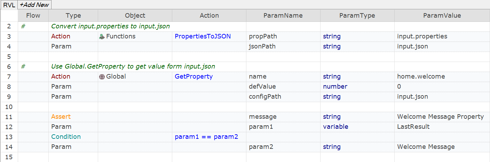

 [Download Now](https://inflectra.github.io/DownGit/#/home?url=https://github.com/Inflectra/rapise-powerpack/tree/master/ReadPropertiesFile)


# Reading .properties in Rapise

[.properties](https://en.wikipedia.org/wiki/.properties) is a file format mainly used in Java related technologies to store the configurable values.

Rapise is based on JavaScript and has `JSON` or `.xlsx` as formats for storing configurable values.

This sample contains a function, used to convert `.properties` file to a `.json`:

```javascript
function PropertiesToJSON(/**string*/propPath, /**string*/jsonPath)
```

## Usage

Copy contents of `User.js` file into same file in your test.

## Calling from JavaScript

```javascript
	// Convert file to JSON
	var json = PropertiesToJSON('input.properties', 'input.json');
	// Read property 'home.title'
	var title = Global.GetProperty("home.title", null, 'input.json');
	
	Tester.AssertEqual('Home title property', title, 'My Tile');
```

## Calling from RVL


