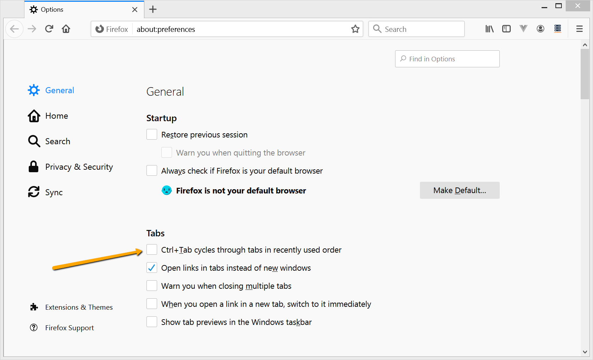

# SelectBrowserTab

This function allows switching between several concurrent browser Tabs. The function assumes that tabs are already open in the browser.

## Usage

The function `SelectBrowserTab` accepts a part of URL as a parameter.

```javascript
    SelectBrowserTab("libraryinformationsystem.org");
    SelectBrowserTab("inflectra");
    SelectBrowserTab("Account");
```

## Known Issues

1. If your test uses library **DomDynamicsCrm**, then you need to add this call in the beginning of the `Test()` function:

```javascript
g_enumAllIEWindows = false;
```

2. If you use this function with Firefox, make sure you have Ctrl+Tab cycles Disabed:



