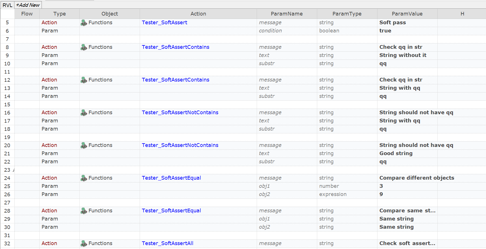

 [Download Now](https://inflectra.github.io/DownGit/#/home?url=https://github.com/Inflectra/rapise-powerpack/tree/master/SoftAssert)

# Tester.SoftAssert and Tester.AssertHasFailures

Enables **SoftAssert** feature. SoftAssert proceeds execution without causing test termination (i.e. ignores `StopOnError` option).

Another use-case, is to have a bunch of SoftAssert statements, followed by a real assertion `Tester.AssertHasFailures` that is only fails if there was previous soft failures.

## Usage

Copy contents of the [User.js](User.js) into your User.js.

## Using from JavaScript

```javascript
	Tester.Assert('Pass0', true);
	Tester.SoftAssert('SoftFailure1', false);
	Tester.SoftAssert('SoftFailure2', true);

	Tester.Assert('Pass1', true);
	
	// How we should fail if there were failures
	Tester.AssertHasFailures('Aftermath', true);
```

## Using from RVL



