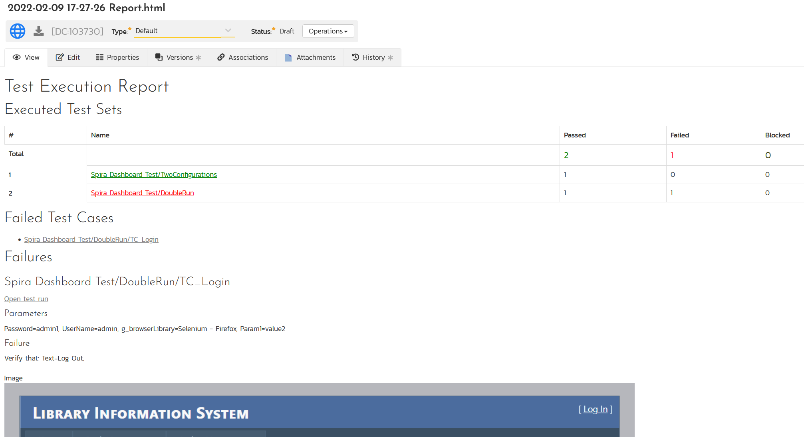
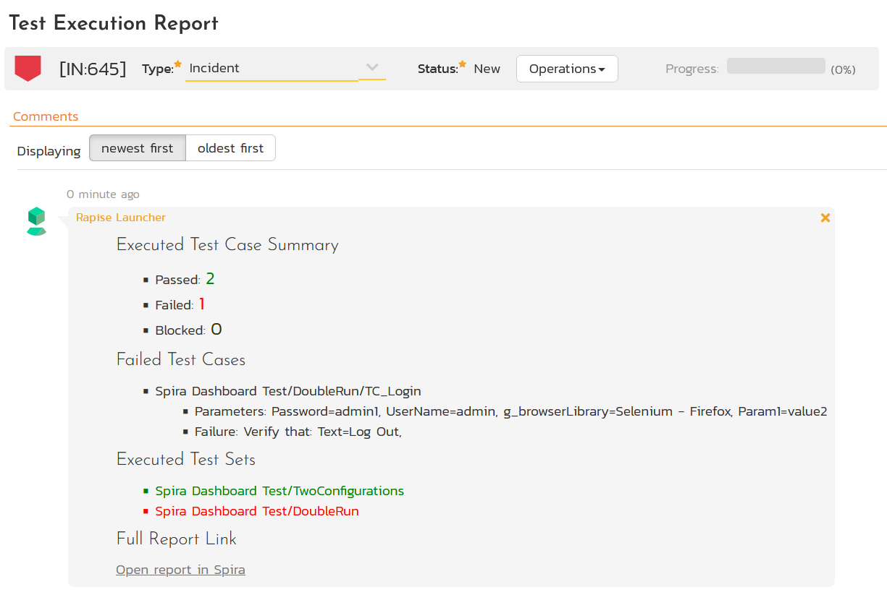
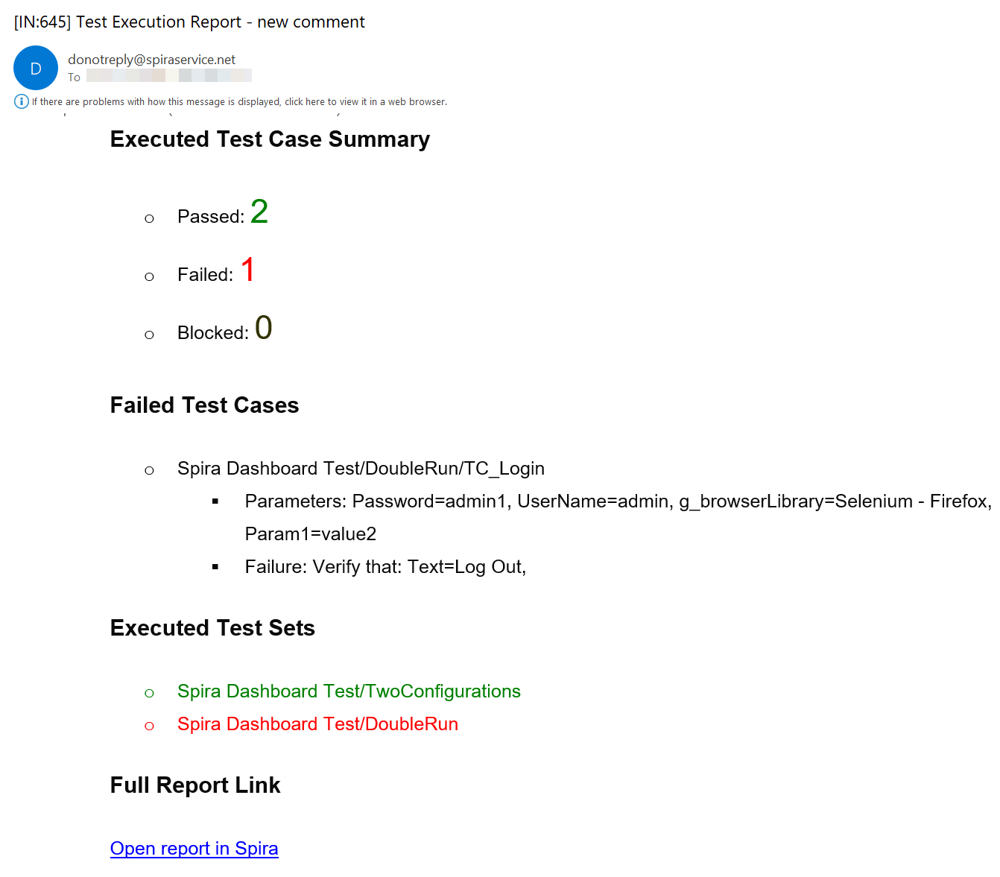

 [Download Now](https://inflectra.github.io/DownGit/#/home?url=https://github.com/Inflectra/rapise-powerpack/tree/master/SpiraGenerateReport)

# Generate Summary Report for Test Execution in Spira

This test contains `Spira_GenerateReport` function that builds a report with test execution summary and uploads it to Spira as a document. Optionally one may configure email notifications in Spira and receive report summary as a notification of new comment added to an incident.

```javascript
Spira_GenerateReport(scope, reportName, incidentId, projectId)
```

```
 	scope is one of:
 		- ID of a project, e.g. 97, project to query for latest test set run performed today
 		- Array of project IDs, e.g. [9, 23, 90], projects to query for latest test set runs performed today
 		- Array of objects, e.g. {projectId: 90, testSetIds[238]}, projects and selected test sets to query for latest runs
 	reportName:
 		- Report file name, optional, default - Report.html
 	incidentId:
 		- Incident ID for comments and email notifications, optional
 	projectId:
 		- Upload report to the project with this ID, optional
```

## Examples

### Example 1

```javascript
Spira_GenerateReport(97);
```
Query all test sets executed today for project 97 and build the summary report. Upload this report to Documents module in Spira and place into `Test Execution Report` folder.

### Example 2

```javascript
Spira_GenerateReport([9, 23, 90], "Report.html", 645, 97);
```

Query all test sets executed today in projects 9, 23, 90 and generate summary report with name Report.html. Upload this report to Documents module in Spira and place into `Test Execution Report` folder. Also generate summary for report and append it as a comment to incident 645 in project 97. If notifications are configured in Spira then users will receive an email with the comment added.

## How to Use

Copy contents of `User.js` into your test project so you may call the functions.

## Screenshots

### Report Contents



### Automatic Comment to an Incident



### Email Notification


