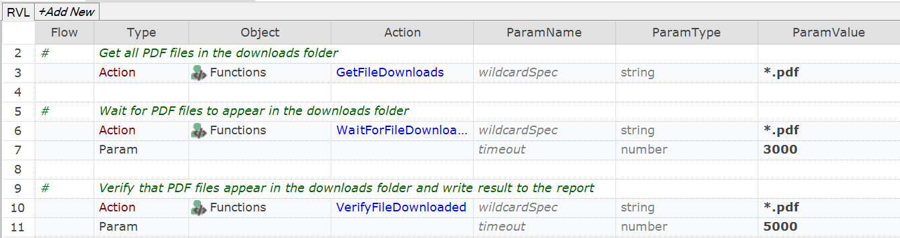

 [Download Now](https://inflectra.github.io/DownGit/#/home?url=https://github.com/Inflectra/rapise-powerpack/tree/master/VerifyFileDownloaded)


# VerifyFileDownloaded

This sample contains a few useful functions to check that file is in the downloads folder.

```javascript
/**
 * Verify that there are files matching the spec in the downloads folder.
 * Write results to the report.
 * If nothing found before the timeout, returns empty string and add failure to the report.
 * @param {wildcardSpec=*.*} file spec. I.e. *.* or *.pdf
 * @param {timeout=30000} wait time in milliseconds.
 */
function VerifyFileDownloaded( /**string*/ wildcardSpec, /**number*/ timeout)

/**
 * Wait for any files matching the spec in the downloads folder.
 * If nothing found before the timeout, returns empty string.
 * @param {wildcardSpec=*.*} file spec. I.e. *.* or *.pdf
 * @param {timeout=30000} wait time in milliseconds.
 */
function WaitForFileDownloads( /**string*/ wildcardSpec, /**number*/ timeout)

/**
 * Get all files matching the spec in the downloads folder
 * If nothing found, returns empty string.
 * @param wildcardSpec file spec. I.e. *.* or *.pdf
 */
function GetFileDownloads( /**string*/ wildcardSpec)
```

## Using

Add contents of [User.js](User.js) into your test's `User.js`.

## Example: Calling from RVL




