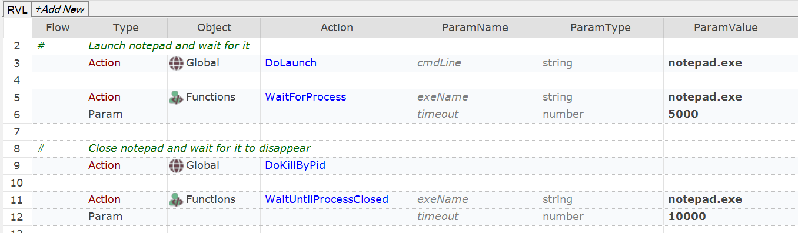

 [Download Now](https://inflectra.github.io/DownGit/#/home?url=https://github.com/Inflectra/rapise-powerpack/tree/master/WaitForProcess)

# Waiting for a Process to Start or to Stop

This sample contains a few useful functions to check that given process is running or not running

```javascript
/**
 * Wait while given process is still running
 */
function WaitUntilProcessClosed(/**string*/exeName, /**number*/timeout) {

/**
 * Wait for given process to appear in the process list
 */
function WaitForProcess(/**string*/exeName, /**number*/timeout) {

```

## Using

Add contents of [User.js](User.js) into your test's `User.js`.

## Example: Calling from RVL




