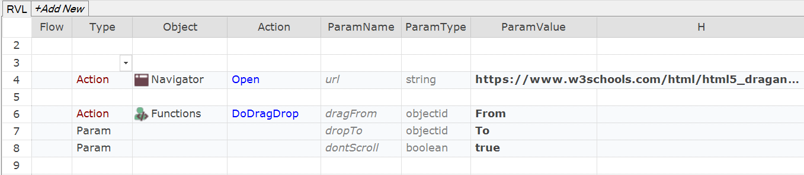

 [Download Now](https://inflectra.github.io/DownGit/#/home?url=https://github.com/Inflectra/rapise-powerpack/tree/master/WebDragNDrop)

# Drag and Drop Example for Web Tests

This sample contains a function `DoDragDrop`. 

## Using

Add contents of [User.js](User.js) into your test's `User.js`.

## Calling form JavaScript

```javascript
	DoDragDrop('From', 'To');
```

## Calling form RVL

