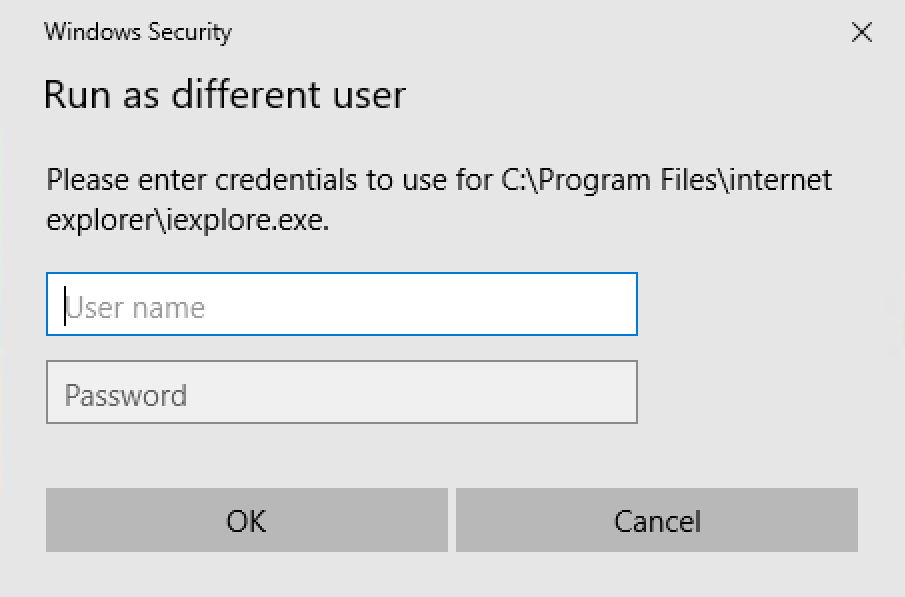

# WindowsSecurityPrompt

Use this test to enter user credentials into Windows Security dialog on Windows 10.

## Usage

### For prompt shown by Internet Explorer


1. Put this function into `*.user.js` file of your test. Update relative path to this test if necessary.

```javascript
function EnterCredentialsIE(/**string*/ user, /**string*/ pwd, /**boolean*/ remember)
{
	var params = { userName: user, password: pwd, remember: remember, type: "IE" };
	Global.DoInvokeTest('%WORKDIR%/../WindowsSecurityPrompt/WindowsSecurityPrompt.sstest', params);
}
```

2. In your test put this at the beginning of the `Test` function.

```javascript
EnterCredentialsIE("<user name>", "<user password>", true);
```

Or call the function in RVL:


### For prompt shown by Run As



1. Put this function into `*.user.js` file of your test. Update relative path to this test if necessary.

```javascript
function EnterCredentialsRunAs(/**string*/ user, /**string*/ pwd)
{
	var params = { userName: user, password: pwd, type: "RunAs" };
	Global.DoInvokeTest('%WORKDIR%/../WindowsSecurityPrompt/WindowsSecurityPrompt.sstest', params);
}
```

2. In your test put this at the beginning of the `Test` function.

```javascript
EnterCredentialsRunAs("<user name>", "<user password>");
```

Or call the function in RVL:


