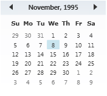
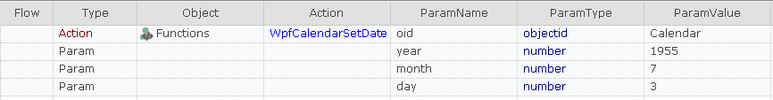
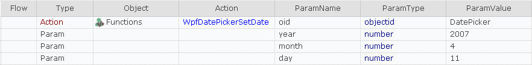
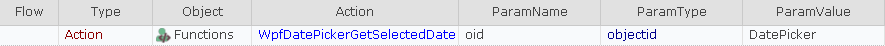

# WPF Date Picker sample

This sample contains functions to help support for typical date controls in [WPF](https://en.wikipedia.org/wiki/Windows_Presentation_Foundation) applications.

## Calendar Control



Once you have such control learned in the object tree you may change its value using a function below:

````javascript
/**
 * Set calendar value for WPF Calendar.
 * @param oid object id
 * @param year
 * @param month (1-12)
 * @param day (1-31)
 */
function WpfCalendarSetDate(/**objectid*/oid, /**number*/year, /**number*/month, /**number*/day)
````

This function may be called from RVL as follows:


One may read current value of the calendar by calling a function:

````javascript
/**
 * Get current value for WPF Calendar.
 * @param oid object id
 */
function WpfCalendarGetSelectedDate(/**objectid*/oid)
````
This function may be called from RVL as follows:


## Date Control


Once you have such control learned in the object tree you may change its value using a function below:

````javascript
/**
 * Set date value for standard WPF Date Picker with Popup Calendar.
 * @param oid object id
 * @param year
 * @param month (1-12)
 * @param day (1-31)
 */
function WpfDatePickerSetDate(/**objectid*/oid, /**number*/year, /**number*/month, /**number*/day)
````

This function may be called from RVL as follows:



One may read current value of the date picker by calling a function:

````javascript
/**
 * Set current value for WPF Date Picker with Calendar Popup.
 * @param oid object id
 */
function WpfDatePickerGetSelectedDate(/**objectid*/oid)
````
This function may be called from RVL as follows:



## AUT and Functions
This sample is shipped with demo AUT containing one date picker and one calendar control ( [DatePickerDemo.exe](https://github.com/Inflectra/rapise-powerpack/blob/master/WpfDatePicker/AUT/DatePickerDemo.exe) ).

All the utility functions mentioned in this topic are available in the for copy paste form here: https://raw.githubusercontent.com/Inflectra/rapise-powerpack/master/WpfDatePicker/User.js . You may copy contents of this file and put it into your functions file or into your common library.

